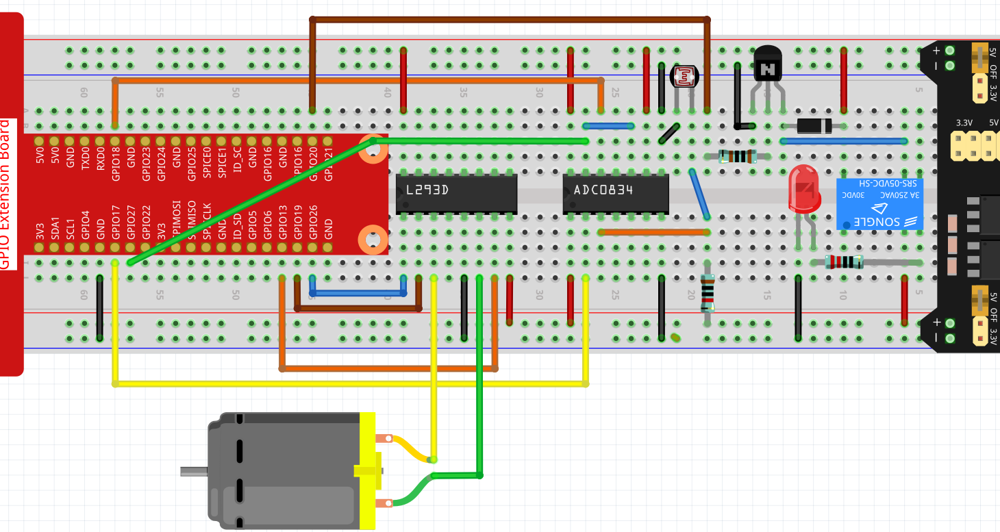
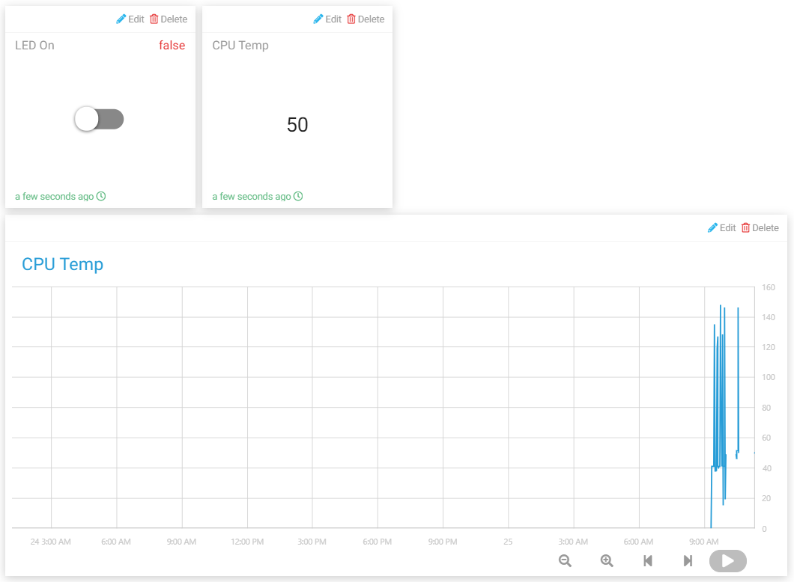

智能窗帘
=================

在这个项目中，我们将模拟一个根据房间亮度自动打开或关闭窗帘的场景。当光敏电阻检测到房间亮度过亮时，树莓派会驱动电机关闭窗帘；当房间亮度太暗时，窗帘会被拉开。

您也可以通过 Cloud4RPi 上的文本小部件查看室内亮度变化，或使用开关小部件控制灯（为了用电安全，本实验使用 LED 代替）。

实验步骤
-------------------------

搭建电路。

打开代码。

.. raw:: html

    <run></run>

.. code-block:: shell

    cd /home/pi/cloud4rpi-raspberrypi-python
    sudo nano smart_curtain.py

找到下面部分并填写正确的设备令牌。

.. code-block:: python

    DEVICE_TOKEN = '__YOUR_DEVICE_TOKEN__'

运行代码。

.. raw:: html

    <run></run>

.. code-block:: shell

    sudo python3 smart_curtain.py

转到 Cloud4RPi 页面，添加一个新的控制面板命名为 **project4**，并通过点击 **Add Widget** 添加3只小部件（ **Switch**， **Text** 和 **Chart**）。

添加后，您可以使用开关小部件来控制 LED；Text 小部件上的光敏电阻值每1分钟更新一次，当值> 100时，电机顺时针旋转5秒；如果该值小于 20，则电机逆时针旋转 5 秒。
你可以在 Chart 部件中看到随着时间推移发生的变化。

代码说明
----------------------

.. code-block:: python

    def getValue():
        analogVal = ADC0834.getResult()
        if analogVal > 100:
            move.clockwise()
            sleep(5)
            move.stop()
        elif analogVal < 20:
            move.contrarotate()
            sleep(5)
            move.stop()
        return analogVal

读取 ADC0834 的 CH0 通道（连接光敏电阻）的值。如果该值 >100，则电机顺时针旋转 5 秒。如果该值小于 20，则电机逆时针旋转 5 秒。

.. code-block:: python

    'CPU Temp': {
            'type': 'numeric',
            'bind': getValue
        },

将 ``getValue()`` 函数放在 ``'bind'`` 键的值中，使led的亮度（ ``getValue()`` 函数的返回值）可以被发送到 **Text** 部件。
