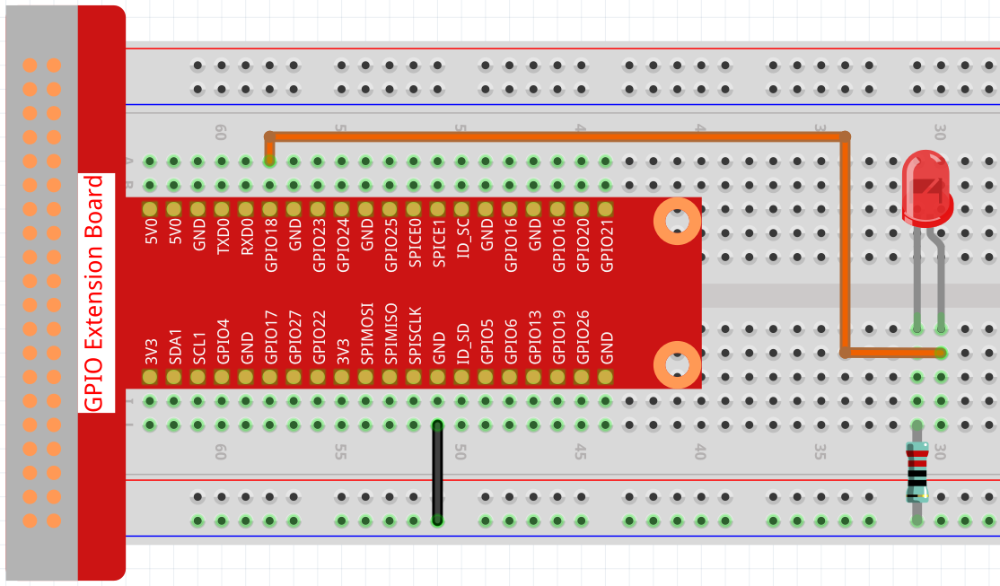
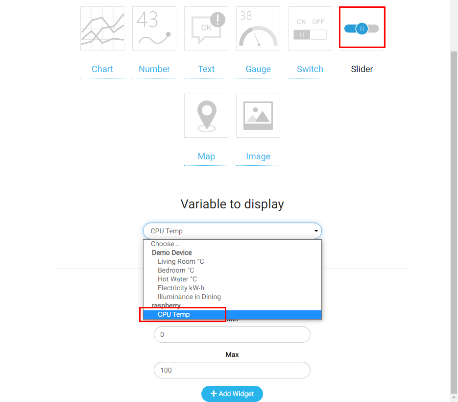
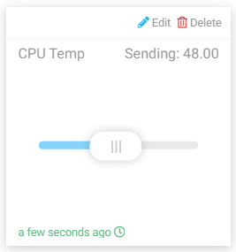

智能灯
=================

在这个项目中，我们将学习使用 Cloud4RPi 的 Silder 小部件控制 LED 的亮度。

实验步骤
-------------------------

搭建电路。

打开代码。

.. raw:: html

    <run></run>

.. code-block:: shell

    cd /home/pi/cloud4rpi-raspberrypi-python
    sudo nano smart_light.py

找到下面的部分并填写正确的设备令牌。

.. code-block:: python

    DEVICE_TOKEN = '__YOUR_DEVICE_TOKEN__'

运行代码。

.. raw:: html

    <run></run>

.. code-block:: shell

    sudo python3 smart_light.py

转到 Cloud4RPi 页面，添加一个名为 project3 的新控制面板，然后单击 **Add Widget** 添加一个 **Slider小部件**。

添加完后，就可以使用 **Slider** 小部件来控制 LED 的亮度了。

代码说明
----------------------

.. code-block:: python

    led_val = GPIO.PWM(LED_PIN, 2000)
    led_val.start(0)

调用 ``GPIO.PWM()`` 函数定义 ``LED_PIN`` 为 PWM 引脚并设置 PWM 引脚的频率为 2000Hz，然后使用 ``start()`` 函数将初始占空比设置为 0。

.. code-block:: python

    led_val.ChangeDutyCycle(value)

Slider 小部件发送到树莓派的值用作 PWM 占空比来改变 LED 的亮度。

.. code-block:: python

    variables = {
        'CPU Temp': {
            'type': 'numeric',
            'value': 0,
            'bind': led_control
        },
    }

通过设置 ``'value'`` 键的值, 我们可以设置Slider部件的初始值, 然后循环读取 ``'value'`` 键的值，并将当前电平 ``LED_PIN`` (函数 ``led_control()`` 的返回值) 发送到Cloud4RPi。

