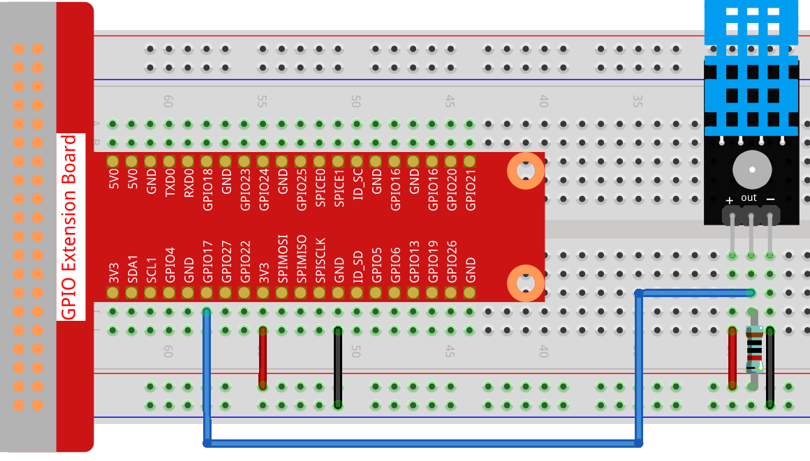
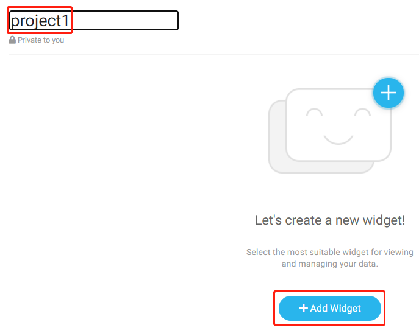
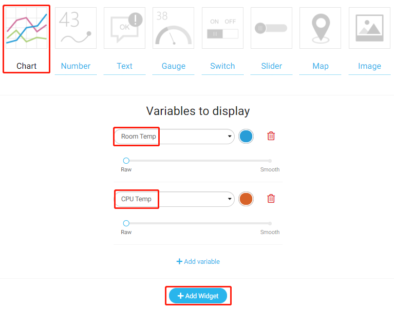
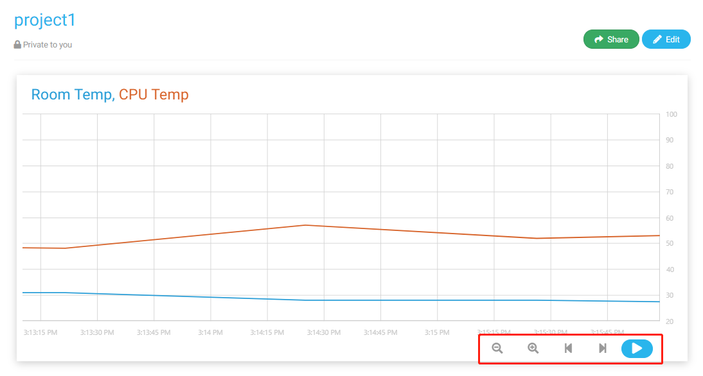

温湿度采集
======================================

在这个项目中，我们使用DHT11读取周围的温湿度，然后在Cloud4RPi上显示出来。

实验步骤
-------------------------

搭建电路。

打开代码。

.. raw:: html

    <run></run>

.. code-block:: shell

    cd /home/pi/cloud4rpi-raspberrypi-python
    sudo nano temperature_and_humidity_acquisition.py

找到以下部分并填写正确的令牌。

.. code-block:: python

    DEVICE_TOKEN = '__YOUR_DEVICE_TOKEN__'

运行代码。

.. raw:: html

    <run></run>

.. code-block:: shell

    sudo python3 temperature_and_humidity_acquisition.py

转到 Cloud4RPi 页面, 添加一个名为 project1 的新控制面板，然后单击 **Add Widget**.

选择一个同时包含 **Room Temp** 和 **CPU Temp** 的 **Chart** 小部件作为要显示的变量。

添加后，您将看到温度（Room Temp）和湿度（CPU Temp）随时间变化的曲线，可以通过单击右下角的选项来调整显示窗口。

代码说明
----------------------

.. code-block:: python

    dht11 = DHT11.DHT11(17)

实例化一个 dht11 对象。

.. code-block:: python

    def getTem():
        result = dht11.get_result()
        while True:
            if result:
                break
            else:
                result = dht11.get_result()
        return result[1]

温度 (``result[1]``) 由该函数获取，直到读取成功才会中断该函数。

.. code-block:: python

    def getHum():
    result = dht11.get_result()
    while True:
        if result:
            break
        else:
            result = dht11.get_result()
    return result[0]

湿度 (``result[0]``) 是通过该函数获取的，同样是读取成功后才会中断。

.. code-block:: python

    variables = {
        'Room Temp': {
            'type': 'numeric',
            'bind': getTem
        },
        'CPU Temp': {
            'type': 'numeric',
            'bind': getHum
        },
    }

温度信息存储在 ``'Room Temp'`` 键中的 ``'bind'`` 里, 湿度信息存储在 ``'CPU Temp'`` 键中的 ``'bind'`` 里. 当 Cloud4RPi 收到 ``variables`` 时，它会将其转换为网页可以识别的 JavaScript 对象。

