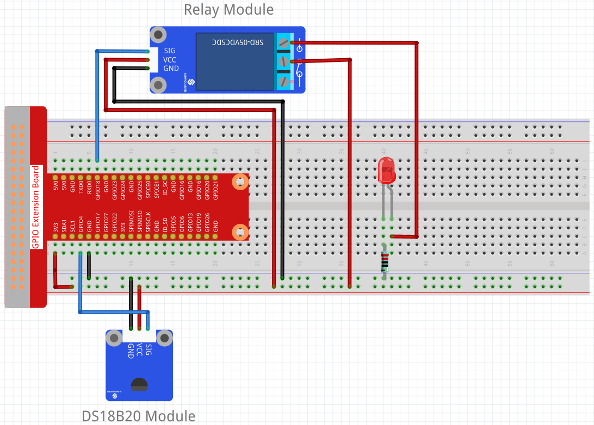
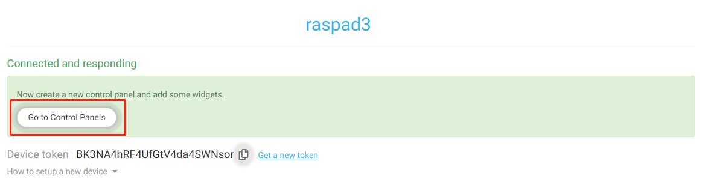

IoT Project
=================

Cloud4RPi is a cloud control panel for your IoT projects. Use dashboard widgets to show device data in real-time and control your IoT devices remotely.

In this chapter, we will build a circuit on the new Raspberry Pi (other preparations are required), then log in to Cloud4RPi on RasPad 3, and console the lights and monitor the sensor values.

.. note::
  The Raspberry Pi that appears in the following refers to the Raspberry Pi used in the experimental circuit, not the Raspberry Pi in RasPad 3. Please make a distinction.

Build Circuit
-------------

First prepare a Raspberry Pi and a MicroSD card with burned image. If your MicroSD card has not burned the image, please read :ref:`Install OS to Your Micro SD Card` first.

Then connect a GPIO Extension Board to the Raspberry Pi. For the specific usage of the GPIO Extension Board, please refer to :ref:`GPIO Extension Board`.

.. image:: img/iot13.png
  :width: 600
  :align: center

This is the build the circuit of the experimental circuit.

.. note::
  The above experimental circuit needs to use a high-voltage power supply.
  
  If you have no experience in using high-voltage power supplies, it is recommended that you use the following experimental circuit instead. Otherwise, if the operation is improper, there will be a risk of electric shock.

Install Cloud4RPi into the Raspberry Pi.
------------------------------------------
Now，power up the Raspberry Pi，after getting the IP of the Raspberry Pi, you can log in to the Raspberry Pi remotely via ssh.

* If you want to know how to get the IP of Raspberry Pi, please read :ref:`Get the IP Address` first.
* If you want to know how to remotely log in to the Raspberry Pi, please read :ref:`Use the SSH Remote Control` first.

It is advisable to update your system before installing.

.. code-block::

    sudo apt update && sudo apt upgrade -y

Install/update the required packages.

.. code-block::

    sudo apt install git python3 python3-pip -y

Install Cloud4RPi with the following command (usually Python 3).

.. code-block::

    sudo pip3 install cloud4rpi

.. note::

  This tutorial only provides the installation method of python3.0 and above. If you are a lower python version, you may need to modify the command.

Log in Cloud4RPi on RasPad 3.
-------------------------------

Insert another MicroSD card into the slot of RasPad 3, and then press and hold the power button to start RasPad 3.

.. warning::
  
  The card slot is set on the back cover and it’s in snap style. Therefore before opening or closing the back cover, you need to take out the microSD card to avoid damaging your microSD card and the internal button board.

.. image:: img/install_sd_card.jpg
  :width: 600
  :align: center

Open Chromium Web Browser and enter this link: https://cloud4rpi.io, and then tap the **CONNECT YOUR DEVICE** button in the middle.

Before using it, you need to register and log in to your Cloud4RPi account.

Connect your Raspberry Pi to Cloud4RPi.
---------------------------------------

After logging in, click the **Devices** option above, and then click **New Device**.

Give your new device a new name, and copy the current **Device token**.

Open the terminal of the Raspberry Pi and download the test examples provided by Cloud4RPi to your Raspberry Pi.

.. code-block::

    git clone https://github.com/cloud4rpi/cloud4rpi-raspberrypi-python.git
    
    cd cloud4rpi-raspberrypi-python

Modify the content of the ``control.py`` file.

.. code-block::

    sudo nano control.py

Find the following line of code.

.. code-block:: python

    DEVICE_TOKEN = '__YOUR_DEVICE_TOKEN__'

Then paste the Device token on the Cloud4RPi server here, and press ``Ctrl`` + ``X`` to complete the modification.

.. code-block:: python

    DEVICE_TOKEN = 'BK3NA4hRF4UfGtV4da4SWNsor'

Run the sample file ``control.py``.

.. code-block:: python

    sudo python3 control.py

Back to the Cloud4RPi server, if the following message appears, it means that RasPad 3 has successfully connected to the Cloud4RPi server.

Use Control Panel
--------------------

Next, start using the control panel on the Cloud4RPi server. The control panel provides many widgets. We can use these widgets to control the light on or off or to receive temperature data.

Click the **Go to Control Panels** button.

.. note::
  When using the Control Panel, you need to always run the ``control.py`` file.

Click the **New Control Panel** button.

.. image:: img/iot6.png
  :width: 700
  :align: center

Enter your Control Panel name, and then click the **Add Widget** button.

Select a **Switch**, then select **LED On** from the drop-down options, and finally select **Add Widget**.

This widget is used to control the light on and off.

Select a **Text**, then select **Room Temp** from the drop-down options, and finally select **Add Widget**.

This widget is used to show the temperature detected by the ds18b20.

Select a **Number**, then select **CPU Temp** from the drop-down options, and finally select **Add Widget**.

This widget is used to show the temperature of the Raspberry Pi CPU.

Select a **Chart**, then select **Room Temp** from the drop-down options, and finally select **Add Widget**.

This widget is used to show the temperature changes detected by ds18b20 over a period of time.

After the addition is complete, you should be able to see these widgets on the Control Panel.

Click the Switch widget on the Control Panel, you will find that the light on the breadboard is on, and the Text widget will show the temperature value read by ds18b20, and the Number widget will show the temperature value of the Raspberry Pi CPU. 
We can also observe temperature changes over a period of time through the Chart widget.

Code Analysis
----------------

Open the ``control.py`` file.

.. code-block:: python

    sudo nano control.py

Drive LED
^^^^^^^^^^^^

This line defines the pin of the LED.

.. code-block:: python

    LED_PIN = 12

Use BOARD naming method and set LED_PIN as output.

.. code-block:: python

    GPIO.setmode(GPIO.BOARD)
    GPIO.setup(LED_PIN, GPIO.OUT)

Here the ``value`` variable refers to the state of the Switch widget on the Control Panel. If the switch is in the open state, the ``value`` is 1, otherwise it is 0.

We can use the ``value`` variable to control the high and low level changes of the LED, so as to achieve the effect of light on and off.

.. code-block:: python

    def led_control(value=None):
        GPIO.output(LED_PIN, value)
        return GPIO.input(LED_PIN)

Read the temperature value of the ds18b20 module.
^^^^^^^^^^^^^^^^^^^^^^^^^^^^^^^^^^^^^^^^^^^^^^^^^

Import the ``ds18b20`` library.

.. code-block:: python

    import ds18b20

Load ``w1`` module, and check whether ds18b20 temperature sensor is available, and return the temperature value, ``ds_sensors``.

.. code-block:: python

    ds18b20.init_w1()
    ds_sensors = ds18b20.DS18b20.find_all()

If the temperature value is read, the temperature value is stored in the **Room Temp** key of the ``variables`` dictionary, otherwise the string ``sensor_not_connected`` is stored.

.. code-block:: python

  variables = {
    'Room Temp': {
    'type': 'numeric' if ds_sensors else 'string',
    'bind': ds_sensors[0] if ds_sensors else sensor_not_connected
    },
  } 

Send the contents of the ``variables`` dictionary to the Cloud4RPi server.

.. code-block:: python

    device.declare(variables)
    device.publish_config()

Read the cpu temperature of the Raspberry Pi.
^^^^^^^^^^^^^^^^^^^^^^^^^^^^^^^^^^^^^^^^^^^^^^^^

Import ``rpi``.

.. code-block:: python

    import rpi

Obtain the cpu temperature of the Raspberry Pi by reading the ``cpu_temp`` value in the rpi library, and store the cpu temperature value of the Raspberry Pi in the ``CPU Temp`` key of the ``variables`` dictionary.

.. code-block:: python

    variables = {

      'CPU Temp': {
            'type': 'numeric',
            'bind': rpi.cpu_temp
      },

    } 

Send the contents of the ``variables`` dictionary to the Cloud4RPi server.

.. code-block:: python

    device.declare(variables)
    device.publish_config()

You can also learn more about the application of the iot project through this video.

.. raw:: html

  <iframe width="695" height="576" src="https://www.youtube.com/embed/QBvjo9VsNtc" title="YouTube video player" frameborder="0" allow="accelerometer; autoplay; clipboard-write; encrypted-media; gyroscope; picture-in-picture" allowfullscreen></iframe>

