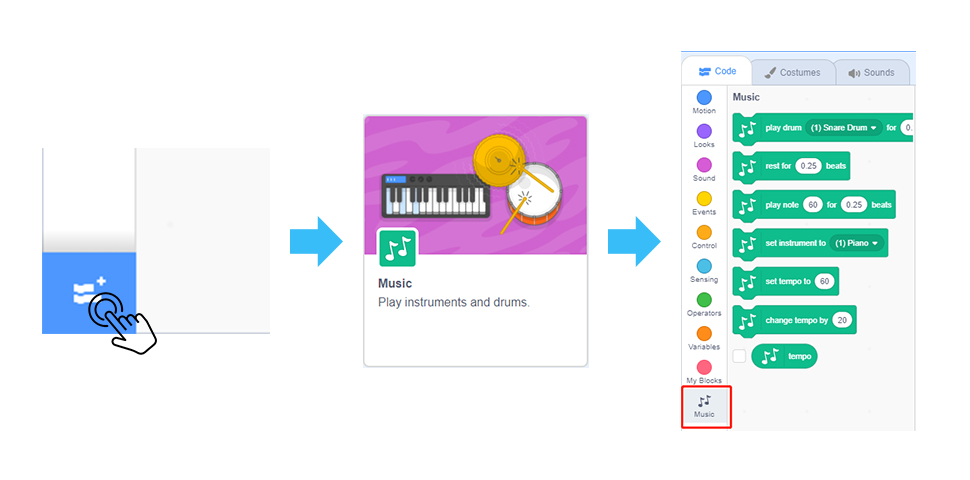
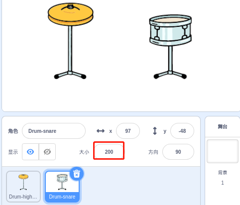
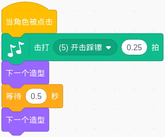
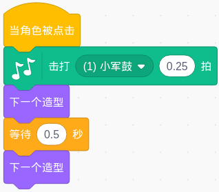

制作音乐
================

描述
-------------

你去过音乐厅吗？它充满了琳琅满目的乐器。这些乐器在音乐家的演奏下发出美妙的声音。

今天我们也将成为音乐家，在Scratch的舞台上添加一些乐器。当您点击不同的乐器时，它们会发出相应的乐器声音。

点击绿旗开始。

.. raw:: html

    <iframe src="https://scratch.mit.edu/projects/526926741/embed" allowtransparency="true" width="695" height="576" frameborder="0" scrolling="no" allowfullscreen></iframe>

或者点击 `Make Music <https://scratch.mit.edu/projects/526926741/editor/>`_, 然后在Scratch官网学习在线教程。

所需组件
-------------------------------

- A RasPad 3
- Scratch 3 (在线或离线)

你会学到
---------------------

- 用 Scratch **添加扩展** 功能添加音乐扩展。
- 修改角色的初始大小。
- 让角色做一些动作。

课程指南
--------------

我们需要鼓
^^^^^^^^^^^^^^^^^^^^^

点击Scratch左下角的 "添加扩展" 图标， 选择 **音乐**, 然后你就会在Scratch的左侧会发现一个新的扩展——音乐。

删除原来的角色, 添加 Drum-highhat 角色和 Drum-snare 角色。

将 Drum-highhat 角色和 Drum-snare 角色调整到合适的大小。

播放 Drum-highhat。
^^^^^^^^^^^^^^^^^^^^

点击 Drum-highhat 角色，在音乐扩展模块中拖出 「**击打...**」 代码块。 

将选项更改为 **(5) 开击踩镲**, 然后使用 "下一个造型" 块来切换鼓的外观。

然后你就可以演奏 Drum-highhat 了。

演奏 Drum-snare.
^^^^^^^^^^^^^^^^^^^^^

点击 Drum-snare 角色并在音乐模块中拖出 「**击打...**」 代码块。

将选项更改为 **(1) 小军鼓**, 然后使用 **下一个造型** 块来切换小军鼓的外观。

然后你就可以演奏小军鼓了。

挑战
------------

相信你能很轻松的掌握并实现这个游戏。接下来我们将添加一些更难的内容来丰富我们的游戏。

- 添加 Drum 角色, Drum Kit 角色和 Drum-cymbal 角色, 修改它们的大小、并选择合适的音效。这样我们就制作了一套架子鼓。

============  =====    =========================
角色           大小      乐器选项
============  =====    =========================
Drum           200      (3)敲鼓边 
Drum Kit       150      (2)低音鼓 
Drum-cymbal    200      (4)碎音钹 
============  =====    =========================

