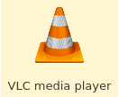
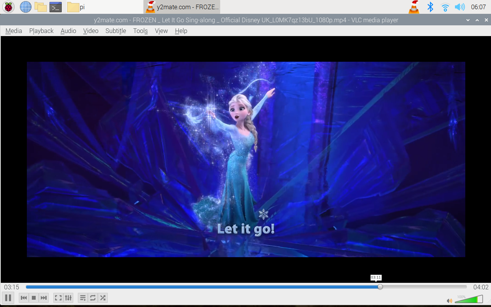
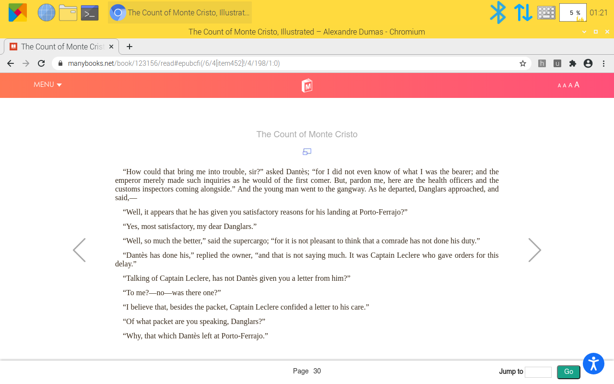
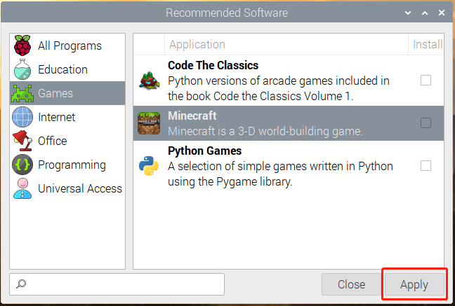
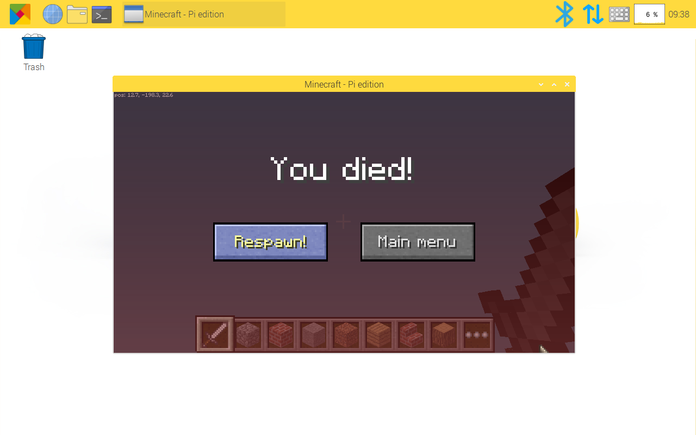

多媒体选项
=================================

在 RasPad 上观看视频、阅读电子书或玩游戏。

看视频
------------------

RasPad 有一个内置的视频播放器：VLC 视频播放器。

双击VLC视频播放器图标直接观看本地视频，或从谷歌浏览器登录YouTube网站观看视频。

阅读电子书
------------

在谷歌浏览器上面在线阅读。

玩游戏
-----------
点击 **Preferences** -> **Recommended Software** -> **Games** 在 RasPad 3 上安装游戏.

比如安装 **Minecraft**, 然后插上键盘鼠标就可以玩了。

