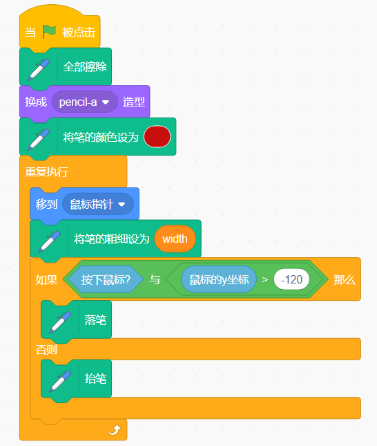

油漆盒
============

描述
---------------

你用过油漆盒吗？油漆盒中的彩色画笔可以用来绘制多彩的世界。今天，我们将制作出一个独特的油漆盒。下面让我们来一起看看吧。

点击绿旗开始。

.. raw:: html

    <iframe src="https://scratch.mit.edu/projects/526931171/embed" allowtransparency="true" width="695" height="576" frameborder="0" scrolling="no" allowfullscreen></iframe>

或者点击 `Paint Box <https://scratch.mit.edu/projects/526931171/editor/>`_, 然后在 Scratch 官网学习在线课程。

所需组件
---------------------------------

首先，需要准备以下组件：

- A RasPad 3
- Scratch 3 (在线或者离线)

你会学到
---------------------

- 使用画笔扩展功能进行绘制。
- 让角色随着鼠标移动。
- 修改服装的大小和光标的位置。
- 使用滑块修改变量的值。

课程指南
--------------

布置画板，增加画笔扩展功能
^^^^^^^^^^^^^^^^^^^^^^^^^^^^^^^^^^^^^^^^^^^^^^^^^^^^^^^^^^^^^^^

首先，我们删除之前的角色，然后将 Pencil 角色和 Block-X 角色添加到 Scratch。

上传角色列表中的Eraser.svg、Red.sprite、Blue.sprite、Green.sprite、Yellow.sprite等文件（之前从 `raspad3.git <https://github.com/sunfounder/raspad3.git>`_ 上下载的），最后将 Pencil 角色和 Block-X 角色的大小分别更改为50和25。

.. image:: img/paint_box1.png
  :width: 600
  :align: center

然后添加扩展功能 **Pen** 。

.. image:: img/paint_box2.jpg
  :width: 700
  :align: center

为 Pencil 添加绘图功能
^^^^^^^^^^^^^^^^^^^^^^^^^^^^^^^^^^^^^^^^

单击 Pencil 角色。首先，我们需要让 Pencil 随着鼠标移动。如果按下鼠标按钮，我们会调用 Pen 扩展函数中的「落笔」块，它可以沿着光标的轨迹进行绘制。否则就会调用「抬笔」块停止绘图。

点击绿旗，尝试用鼠标控制铅笔画一个笑脸。您会发现图像不是从 Pencil 的尖端绘制的。

.. note::
  由于光标不在铅笔尖上，所以绘制的线是从铅笔的中间绘制的。

点击 **造型**, 选择整个 Pencil 角色并移动它直到画笔尖端与十字光标对齐。

改变铅笔的绘画颜色。
^^^^^^^^^^^^^^^^^^^^^^^^^^^^^^^^^^^^^^^^^^^^^^^^^

如何实现当我们点击舞台下方的颜色选项时，Pencil 会切换相应的颜色？

首先我们为红色部分编写代码，当它被点击时，广播发出一个“红色”消息。

然后返回到铅笔部分的代码，当它收到“红色”消息时，我们将铅笔的颜色更改为红色。

同样的方法，为蓝色部分编写代码，当它被点击时，广播发出一个“蓝色”消息。

.. image:: img/paint_box7.png
  :width: 300
  :align: center

再次返回铅笔部分的代码。当它收到“blue”消息时，我们将 Pencil 的颜色更改为蓝色。

在绘画之前，我们清除舞台上的场景并将铅笔颜色设置为红色。

增加清晰绘图功能。
^^^^^^^^^^^^^^^^^^^^^^^^^^^^^^^^^^^^^^^^^^^

有时我们在绘制时会发生意外，所以我们需要添加一个擦除的功能。首先选择 Block-X 角色，当它被点击时，清除所有屏幕。

然后为铅笔设置一个新的造型, 单击 "造型" 选项, 从左下角的图标中选择 **上传造型** 选项来上传 **Eraser.svg** 文件。

适当修改橡皮擦的大小，然后将其放置在光标的右上角。

开始为橡皮擦编写代码，当它被点击时，广播发出一条“橡皮擦”消息。

然后继续为铅笔添加代码，当收到橡皮擦发来的信息时，铅笔就会切换成橡皮擦。

这样当我们点击橡皮擦时，就可以让铅笔切换变成橡皮擦了。

然后将颜色改为与舞台背景色一致的白色，从而实现局部擦除的功能。

切换画笔以以及它的宽度
^^^^^^^^^^^^^^^^^^^^^^^^^^^^^^^^^^^^^^^^^^^^

当铅笔切换成橡皮擦时，我们可以通过点击绘图板上的红色和蓝色将橡皮擦重新切换回铅笔。

.. image:: img/paint_box13.png
  :width: 400
  :align: center

我们还可以随时改变铅笔的宽度。

新建一个名为 "width" 的变量, 然后右击舞台上的 "width" 变量，选择滑杆，你就可以在舞台上看到一个滑块，通过它可以改变“width”变量的值。

.. image:: img/paint_box15_2.jpg
  :width: 400
  :align: center

用变量 "width" 来调整铅笔的大小。

.. image:: img/paint_box16.png
  :width: 400
  :align: center

限制铅笔的绘画范围
^^^^^^^^^^^^^^^^^^^^^^^^^^^^^^^^^^^^^^^^^

只有当铅笔进入绘图区，才可以进行绘画。

.. image:: img/paint_box17.png
  :width: 600
  :align: center

当钢笔进入工具栏时，也就是当y坐标小于等于-120时，我们需要调用「pen up」函数停止绘画。

挑战
----------

相信你很快就能掌握并实现这个游戏，下面可以添加额外的内容来使你的游戏更丰富。

- 添加更多颜色画笔来制作属于您的油漆盒。

