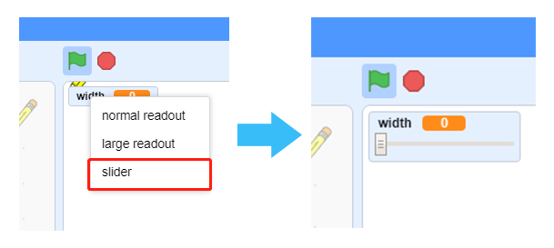
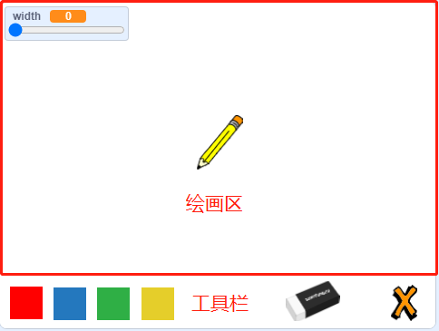

.. note::

    Hello, welcome to the SunFounder Raspberry Pi & Arduino & ESP32 Enthusiasts Community on Facebook! Dive deeper into Raspberry Pi, Arduino, and ESP32 with fellow enthusiasts.

    **Why Join?**

    - **Expert Support**: Solve post-sale issues and technical challenges with help from our community and team.
    - **Learn & Share**: Exchange tips and tutorials to enhance your skills.
    - **Exclusive Previews**: Get early access to new product announcements and sneak peeks.
    - **Special Discounts**: Enjoy exclusive discounts on our newest products.
    - **Festive Promotions and Giveaways**: Take part in giveaways and holiday promotions.

    👉 Ready to explore and create with us? Click [|link_sf_facebook|] and join today!

Paint Box
============

Description
---------------

Have you ever had a Paint Box? You can use the colorful brushes in the Paint Box to paint a colorful world. Today we are also making an exclusive Paint Box on scratch. Let's take action.

Click on the green flag to start. 

.. raw:: html

    <iframe src="https://scratch.mit.edu/projects/526931171/embed" allowtransparency="true" width="695" height="576" frameborder="0" scrolling="no" allowfullscreen></iframe>

Or click `Paint Box <https://scratch.mit.edu/projects/526931171/editor/>`_, and then learn online tutorial on the Scratch official website.

Required Components
---------------------------------

First, you need to prepare the following components:

- A RasPad 3
- Scratch 3 (either online or offline)

You Will Learn
---------------------

- Use the Pen extension function to draw on scratch.
- Let the sprite move with the mouse.
- Modify the size of the costume and the location of the cursor.
- Use the slider to modify the value of the variable.

Lesson Guide
--------------

Lay out the drawing board, add Pen expansion function
^^^^^^^^^^^^^^^^^^^^^^^^^^^^^^^^^^^^^^^^^^^^^^^^^^^^^^^^^^^^^^^

First, we delete the previous sprite, and then add the Pencil sprite and Block-X sprite to Scratch.

Upload **Eraser.svg, Red.png, Blue.png, Green.png, Yellow.png** and other files in the Sprite list (You have downloaded from `raspad3.git <https://github.com/sunfounder/raspad3.git>`_ before.), and finally set the size of the Pencil sprite and Block-X sprite Change to 50.

Then, we add the **Pen** extension function.

Add drawing function to Pencil sprite
^^^^^^^^^^^^^^^^^^^^^^^^^^^^^^^^^^^^^^^^

Click on the Pencil sprite. First, we need to make the Pencil sprite move with the mouse. If the mouse button is pressed, we call the 「**pen down**」 block in the Pen extension function, which can draw along the track of the cursor. Otherwise, call the「**pen up**」 block to stop drawing.

.. image:: img/paint_box3.png
  :width: 500
  :align: center

Click on the green flag and try to control the Pencil sprite with the mouse to draw a smiley face. You will find that the image is not drawn from the tip of the Pencil.

.. note::
  Since the cursor is not on the Pencil tip, the line drawn is drawn from the middle of the Pencil sprite.

We click on the **Costumes**, select the entire Pencil sprite and move it until the Pencil tip is aligned with the cross cursor.

.. image:: img/paint_box4.png
  :width: 500
  :align: center

Let the Pencil sprite change the painting color.
^^^^^^^^^^^^^^^^^^^^^^^^^^^^^^^^^^^^^^^^^^^^^^^^^

How to achieve that when we click on the color option below the stage, the Pencil sprite will switch the corresponding color?

First we write code for the Red sprite, when it is clicked, we broadcast a new "red" message.

.. image:: img/paint_box5.png
  :width: 400
  :align: center

Then we return the code of the Pencil sprite, and when it receives the "red" message, we change the color of the Pencil to red.

.. image:: img/paint_box6.png
  :width: 400
  :align: center

In the same way, we also write code for the Blue sprite, and when it is clicked, we broadcast a new "blue" message.

Return the code of the Pencil sprite. When it receives the "blue" message, we change the color of the Pencil to blue.

Before painting, we clear the scene on the stage and set the Pencil color to red. Zoom in on the stage area and try your brush again.

.. image:: img/paint_box8.png
  :width: 400
  :align: center

Add the function of clear drawing image.
^^^^^^^^^^^^^^^^^^^^^^^^^^^^^^^^^^^^^^^^^^^

Sometimes accidents happen when we draw, so we need to add a clear function. First select the Block-X sprite, when it is clicked, we clear all the screens.

.. image:: img/paint_box9.png
  :width: 400
  :align: center

Next, we set a new costume for the Pencil sprite, click the "Costumes" tab, and then select the **Upload Costume** option from the icon on the bottom left to upload the **Eraser.svg** file.

Modify the size of the Eraser garment appropriately, and then place it on the upper right of the cursor.

.. image:: img/paint_box10.png
  :width: 700
  :align: center

We started programming the Eraser sprite, and when it was clicked, we broadcast a new "eraser" message.

.. image:: img/paint_box11.png
  :width: 400
  :align: center

Then continue to add code for the Pencil sprite. When it receives the "eraser" message, it will change to the Eraser costume, 

so that when we click on the Eraser sprite, we can change the Pencil sprite's costume to look like an Eraser sprite.

Then change the color to white that is consistent with the background color of the stage, so as to achieve the function of partial removal.

.. image:: img/paint_box12.png
  :width: 400
  :align: center

Toggle clothing and brush width tools.
^^^^^^^^^^^^^^^^^^^^^^^^^^^^^^^^^^^^^^^^^^^^

When the costume of the Pencil sprite is switched to Eraser, we need to switch the costume of the Pencil sprite to the Pencil-a costume by clicking the red and blue on the drawing board, so when we receive the "red" message and the "blue" message, We want to switch back to the original Pencil-a costume.

In order to make our painting function more fun, we need to be able to change the width of the Pencil at any time.

Create a new variable named "width", then right-click the "width" variable on the stage, select slider, and then you will see a slider on the stage that can change the value of the "width" variable.

Use the value of the variable "width" as the size of the Pencil.

Limit the painting range of the Pencil.
^^^^^^^^^^^^^^^^^^^^^^^^^^^^^^^^^^^^^^^^^

Only when the Pencil enters the drawing area, can painting be allowed.

When the pen enters the toolbar, that is, when the y coordinate is less than or equal to -120, we need to call the 「**pen up**」 function to stop painting.

Challenge
----------

I believe that you will be smart enough to program and implement this game soon. Next, we will add some challenges to enrich our game content.

- Add more color brushes to make a Paint Box that belongs to you.

