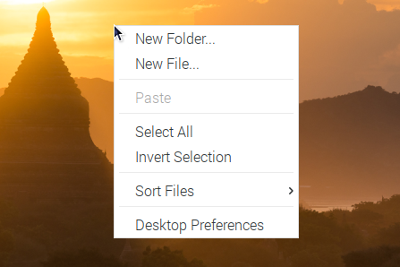

Quick User Guide
===================
* :ref:`Interfaces Introduction`
* :ref:`Power on the RasPad`
* :ref:`Volume and Brightness Settings`
* :ref:`Install Virtual Keyboard on RasPad`
* :ref:`Right Click on RasPad`
* :ref:`Connect Headphones or Other Screens`

Interfaces Introduction
--------------------------

.. image:: img/assembling16.png
  :width: 600
  :align: center

.. image:: img/assembling17.png
  :width: 600
  :align: center

Power on the RasPad
------------------------

Now, insert the SD card firmly.

.. warning::
  
  The card slot is set on the back cover and it’s in snap style. Therefore before opening or closing the back cover, you need to take out the microSD card to avoid damaging your microSD card and the internal button board.

.. image:: img/assembling18.png
  :width: 600
  :align: center

Take out the power adapter and power cable.

.. image:: img/assembling19.png
  :width: 550
  :align: center

Insert one side of the power cable into the power adapter, and the other side to a socket. In case of any accident, children should be accompanied by parents.

.. image:: img/assembling20.png
  :width: 550
  :align: center

Plug the power adapter into the RasPad power port.

.. image:: img/assembling21.png
  :width: 600
  :align: center

At this time, one of the green LED might be blinking and the charging icon will appear, saying RasPad is charging.

.. image:: img/assembling22.png
  :width: 600
  :align: center

The number of lit green LEDs indicates the percentage of battery. When only one indicator LED is lit (33%), a low voltage warning icon will appear, indicating that RasPad needs to be charged.

.. image:: img/assembling23.png
  :width: 600
  :align: center

The power button is on the right side.

Press and hold for over 3 seconds to power on/off the RasPad and short press to turn 
on/off the screen.

.. image:: img/assembling24.png
  :width: 600
  :align: center

Now press and hold the power button for over 3 seconds and you'll see the 
RasPad is booting up.

.. image:: img/assembling25.png
  :width: 600
  :align: center

Volume and Brightness Settings
--------------------------------------

Now, the red LED is lit up, that is to say the RasPad is on.

.. image:: img/assembling27.png
  :width: 600
  :align: center

At this point, the RasPad should be in the boot-up state. If the screen is too bright, short press the brightness button to enter the brightness adjustment page.

.. image:: img/assembling28.png
  :width: 600
  :align: center

A brightness adjustment bar will appear on the screen.

.. image:: img/assembling29.png
  :width: 600
  :align: center

The brightness can be adjusted via these two buttons.

.. image:: img/assembling30.png
  :width: 600
  :align: center

After three seconds without operation, the brightness bar on the screen automatically disappears. The brightness should not be too high or too low, 
otherwise it will be harmful to the eyes.

.. image:: img/assembling31.png
  :width: 550
  :align: center

If you adjust the volume, press the volume button once to enter the volume 
adjustment page.

.. image:: img/assembling32.png
  :width: 600
  :align: center

Then press these two buttons to adjust volume.

.. image:: img/assembling33.png
  :width: 600
  :align: center

Install Virtual Keyboard on RasPad
-------------------------------------

When you use a touch panel such as RasPad, you can connect an external keyboard to help you do a text input operation, but it is best to install a virtual keyboard.

Install the required software with the following command.

.. code-block:: shell

  sudo apt install onboard
  sudo apt install at-spi2-core

In order to make the virtual keyboard have a better effect, you need to do further settings.

Click the Raspberry Pi icon in the upper left corner and select **Preferences** -> **Onboard Settings**.

.. image:: img/onboard.png

In the **General** option, check the following 2 items. When you check **Automatically display when editing text**, you will be prompted to reboot, you can reboot after all settings are complete.

.. image:: img/keyboard1.png

In the **Window** option, check **Dock to screen edge**.

.. image:: img/keyboard2.png

And in **Auto-show** option, check **Auto-show when editing text** again.

.. image:: img/keyboard3.png

The next 2 items are optional, the ones checked in the picture are recommended by us, you can also check other ones.

In **Layout** option, **Small** is recommanded.

.. image:: img/keyboard4.png

In **Theme** option, **DarkRoom** is recommanded.

.. image:: img/keyboard5.png

Right Click on RasPad
-------------------------
Touchscreen tablets and displays make it easy for you to perform simple navigation tasks with your fingers or stylus, but at some point, you may want to use right-click commands to quickly access context-specific shortcuts.

Here we use ``evdev-rce`` to make RasPad's right-click command still available.

Enter the following command to install the required software.

  .. code-block:: shell

    sudo apt install build-essential libevdev2 libevdev-dev
    git clone 'https://github.com/PeterCxy/evdev-right-click-emulation.git'
    cd 'evdev-right-click-emulation'

Enter the following command to build.

  .. code-block:: shell

    make all

Copy the file to the ``/usr`` directory.

  .. code-block:: shell

    sudo cp 'out/evdev-rce' '/usr/local/bin/'

Make it executable.

  .. code-block:: shell

    sudo chmod +x '/usr/local/bin/evdev-rce'

Modify the /etc/rc.local file to enable boot-up.

  .. code-block:: shell

    sudo nano /etc/rc.local

After entering rc.local, add the following command before ``exit 0``.

.. code-block:: shell

  sudo /usr/local/bin/evdev-rce

After restarting, you can long press on the RasPad desktop and see if the right click function appears.

.. code-block:: shell

  sudo reboot

Connect Headphones or Other Screens
-----------------------------------------

Plug in the headphone if you need.

.. image:: img/assembling34.png
  :width: 600
  :align: center

The headphone volume can only be adjusted on the screen, so you need to 
enter the RPi desktop firstly through tapping the top left menu icon.

.. image:: img/assembling35.png
  :width: 550
  :align: center

Just tap the speaker icon, and the volume control box will appear. Slide the 
volume cursor to volume up or down.

.. image:: img/assembling36.png
  :width: 550
  :align: center

When wearing headphones, pay attention not to adjust the volume too much 
high, in case of “hard of hearing”.

.. image:: img/assembling37.png
  :width: 600
  :align: center

If you want to set up your dual monitors, you can add a monitor via HDMI cable 
and plug a mouse and a keyboard.

.. image:: img/assembling38.png
  :width: 600
  :align: center

Now, you can control your computer on RasPad.

.. image:: img/assembling39.png
  :width: 600
  :align: center

