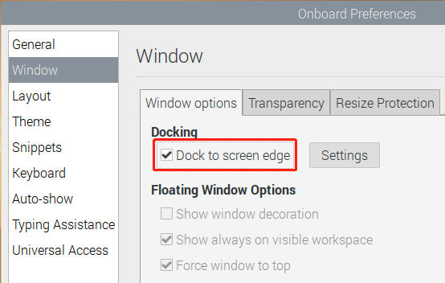
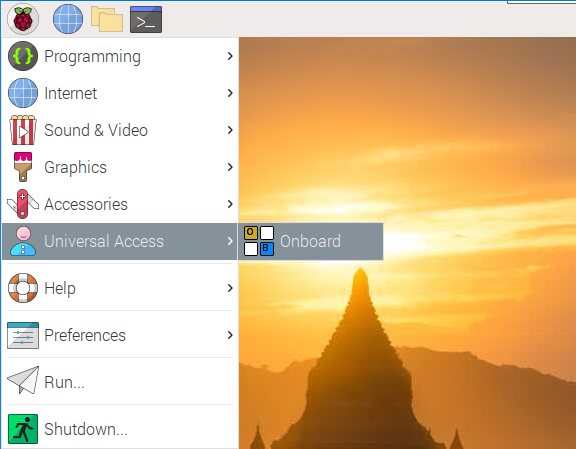
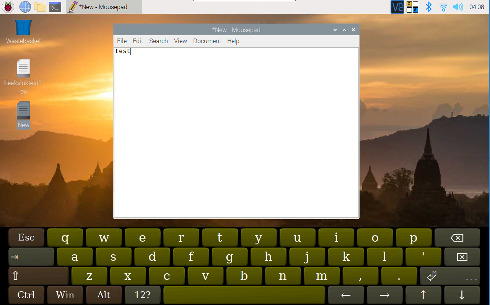

QUICK USER GUIDE
===================
* :ref:`Interfaces Introduction`
* :ref:`Power on the RasPad`
* :ref:`Volume and Brightness Settings`
* :ref:`Install Virtual Keyboard on RasPad`
* :ref:`Right Click on RasPad`
* :ref:`Calibrate the Rotating Screen Function`
* :ref:`Connect Headphones or Other Screens`

Interfaces Introduction
--------------------------

.. image:: img/assembling16.png
  :width: 600
  :align: center

.. image:: img/assembling17.png
  :width: 600
  :align: center

Power on the RasPad
------------------------

Insert the micro-SD card into the SD port of the RasPad, then press the power button.

.. warning::
  
  The SD card slot is a snap-in style attached to the back cover. Before removing or replacing the back cover, remove the micro-SD card to avoid damaging the micro-SD card and the RasPad's internal button board.

.. image:: img/assembling18.png
  :width: 600
  :align: center

Take out the power adapter and power cable.

.. image:: img/assembling19.png
  :width: 550
  :align: center

Insert one side of the power cable into the power adapter, and the other side to an outlet (an adult will be needed if the user is a minor).

.. image:: img/assembling20.png
  :width: 550
  :align: center

Plug the power adapter into the RasPad power port.

.. image:: img/assembling21.png
  :width: 600
  :align: center

At this time, one of the green LED might be blinking and the charging icon will appear, indicating that the RasPad is charging.

.. image:: img/assembling22.png
  :width: 600
  :align: center

The number of green LEDs indicates battery percentage. When only one green LED is visible (indicating the battery is at or below 33%), a low-power warning icon will appear, indicating that RasPad needs to be charged.

.. image:: img/assembling23.png
  :width: 600
  :align: center

The power button is on the right side.

Press and hold for over three seconds to power the RasPad on or off. A short press will turn the screen on or off.

.. image:: img/assembling24.png
  :width: 600
  :align: center

After pressing and holding the power button for over three seconds, the RasPad display will show the RasPad booting up.                                                                                                                                                                           

.. image:: img/assembling25.png
  :width: 600
  :align: center

Volume and Brightness Settings
--------------------------------------

Next to the power button, the red LED should now be lit, indicating that the RasPad is powered on.

.. image:: img/assembling27.png
  :width: 600
  :align: center

At this point, the RasPad should be booted up.

If the screen is too bright, give the brightness button a short press to enter the screen-brightness adjustment page.

.. image:: img/assembling28.png
  :width: 600
  :align: center

A brightness adjustment bar will appear on the screen.

.. image:: img/assembling29.png
  :width: 600
  :align: center

The brightness can be adjusted via these two buttons.

.. image:: img/assembling30.png
  :width: 600
  :align: center

After three seconds without operation, the brightness bar on the screen automatically disappears. The brightness should not be too high or too low, 
otherwise it will be harmful to the eyes.

.. image:: img/assembling31.png
  :width: 550
  :align: center

To adjust the volume, press the volume button once to enter the volume adjustment page.

.. image:: img/assembling32.png
  :width: 600
  :align: center

Then press these two buttons to adjust the volume.

.. image:: img/assembling33.png
  :width: 600
  :align: center

Install Virtual Keyboard on RasPad
-------------------------------------

When you use a touch panel such as RasPad, you can connect an external keyboard to help you do a text input operation, but it is best to install a virtual keyboard.

Install the required software with the following command.

.. code-block:: shell

  sudo apt install onboard
  sudo apt install at-spi2-core

In order to make the virtual keyboard have a better effect, you need to do further settings.

Click the Raspberry Pi icon in the upper left corner and select **Preferences** -> **Onboard Settings**.

.. image:: img/onboard.png

In the **General** option, check the following 2 items. When you check **Automatically display when editing text**, you will be prompted to reboot, you can reboot after all settings are complete.

.. image:: img/keyboard1.png

In the **Window** option, check **Dock to screen edge**.

And in **Auto-show** option, check **Auto-show when editing text** again.

.. image:: img/keyboard3.png

The next 2 items are optional, the ones checked in the picture are recommended by us, you can also check other ones.

In **Layout** option, **Small** is recommanded.

.. image:: img/keyboard4.png

In **Theme** option, **DarkRoom** is recommanded.

.. image:: img/keyboard5.png

After the setting is complete, restart RasPad. Every time you restart RasPad, you need to click **General Access** -> **Onboard** to enable the virtual keyboard.

Now you can use this keyboard to edit your files or codes.

Right Click on RasPad
-------------------------
Touchscreen tablets and displays make it easy for you to perform simple navigation tasks with your fingers or stylus, but at some point, you may want to use right-click commands to quickly access context-specific shortcuts.

Here we use ``evdev-rce`` to make RasPad's right-click command still available.

Enter the following command to install the required software.

  .. code-block:: shell

    sudo apt install build-essential libevdev2 libevdev-dev
    git clone 'https://github.com/PeterCxy/evdev-right-click-emulation.git'
    cd 'evdev-right-click-emulation'

Enter the following command to build.

  .. code-block:: shell

    make all

Copy the file to the ``/usr`` directory.

  .. code-block:: shell

    sudo cp 'out/evdev-rce' '/usr/local/bin/'

Make it executable.

  .. code-block:: shell

    sudo chmod +x '/usr/local/bin/evdev-rce'

Modify the /etc/rc.local file to enable boot-up.

  .. code-block:: shell

    sudo nano /etc/rc.local

After entering rc.local, add the following command before ``exit 0``.

.. code-block:: shell

  sudo /usr/local/bin/evdev-rce &

After restarting, you can long press on the RasPad desktop and see if the right click function appears.

.. code-block:: shell

  sudo reboot

.. image:: img/right_click.png
  :align: center

Calibrate the Rotating Screen Function
-------------------------------------------

When you rotate the RasPad 3, the reason why the Raspberry Pi desktop does not follow the rotation is that the built-in Accel SHIM module is not calibrated.

The calibration steps are as follows：

Open the a Terminal and enter the command ``sudo auto-rotator calibrate`` to run the calibration script.

Now start to rotate the RasPad 3 according to the picture below. Rotate 360° from left to right, and finally return to the front.

.. image:: img/rotate1.jpg

Then rotate 360° from top to bottom, and finally return to the front.

.. image:: img/rotate2.jpg

After the calibration is complete, press ``Ctrl + C`` to exit the calibration script and restart RasPad 3 through the ``sudo reboot`` command.

Connect Headphones or Other Screens
-----------------------------------------

Plug in the headphone if you need.

.. image:: img/assembling34.png
  :width: 600
  :align: center

The headphone volume can only be adjusted on the desktop screen. Enter the Raspberry Pi desktop by tapping the top left menu icon of the RasPad Launcher.

.. image:: img/assembling35.png
  :width: 550
  :align: center

Tap the speaker icon and the volume control box will appear. Slide the volume cursor up or down tto adjust the headphone's volume.

.. image:: img/assembling36.png
  :width: 550
  :align: center

.. warning:: 

  When wearing headphones, do not adjust the volume too high.

.. image:: img/assembling37.png
  :width: 600
  :align: center

Use the HDMI port to add a second monitor, and the USB ports for a mouse and a keyboard.

.. image:: img/assembling38.png
  :width: 600
  :align: center

.. image:: img/assembling39.png
  :width: 600
  :align: center

