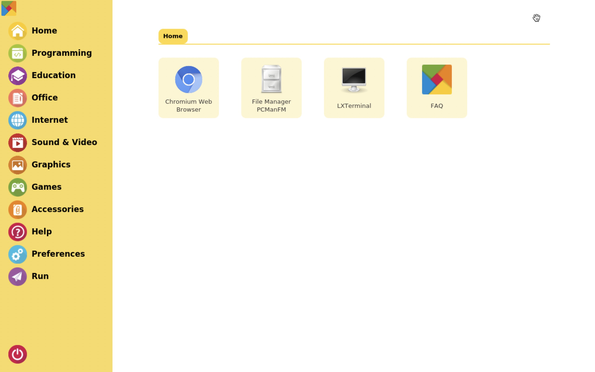

RASPAD LAUNCHER
==================

Introduction
------------------
RasPad Launcher is an open source software that simulates a launcher menu, with a focus on improving the users touchscreen experience with the RasPad or other touchscreens.

.. note::
    If you want to use the original desktop of the Raspberry Pi, you can skip this chapter.

Installation Guide
--------------------

Download the RasPad Launcher package, and extract it.

.. raw:: html

    <run></run>

.. code-block::

    wget https://github.com/raspad-tablet/raspad-launcher/releases/latest/download/raspad-launcher.zip
    unzip raspad-launcher.zip
    cd raspad-launcher

The script will install the following:

* RasPad launcher with desktop profile.
* RasPad FAQ desktop profile (Just a quick icon to browser RasPad FAQ webpage).
* display auto rotate for Accl SHIM.

Run install script.

.. raw:: html

    <run></run>

.. code-block::

    chmod +x install
    sudo ./install

.. note::

    To manually install RasPad Launcher and specific components, please refer to `RasPad Launcher <https://github.com/raspad-tablet/raspad-launcher/blob/main/docs/installation-guide.md>`_.