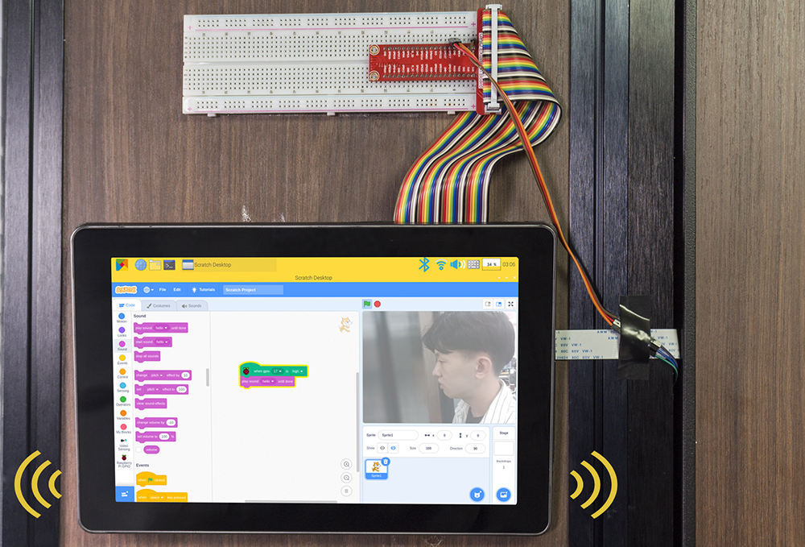
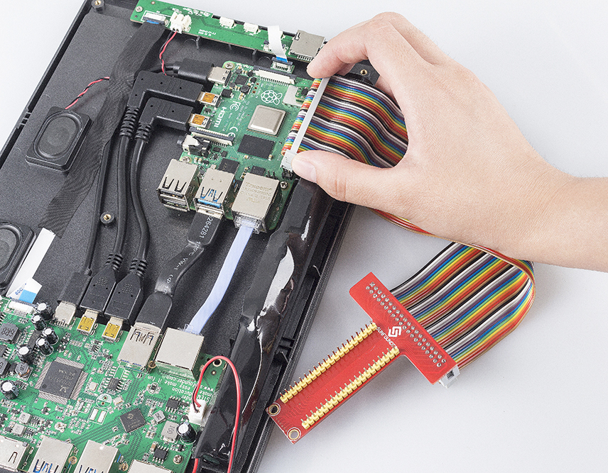
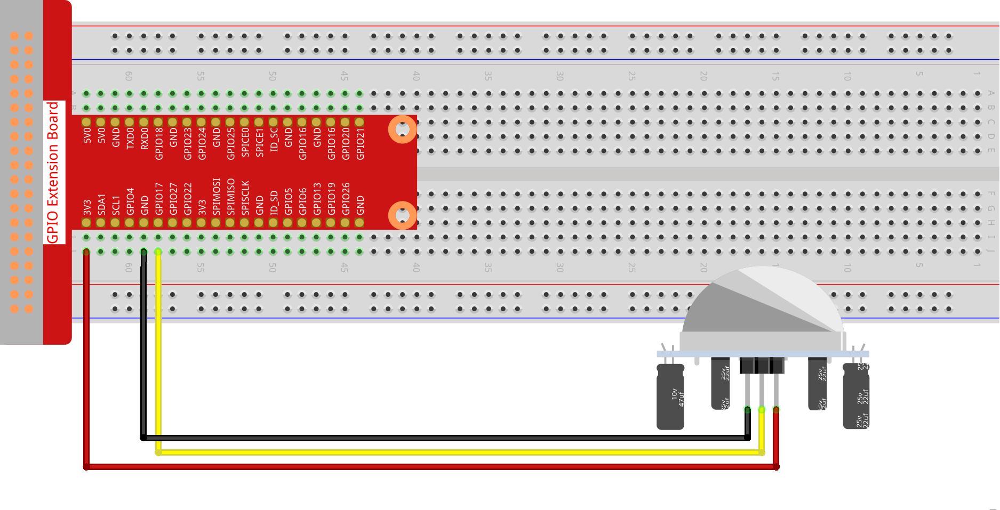
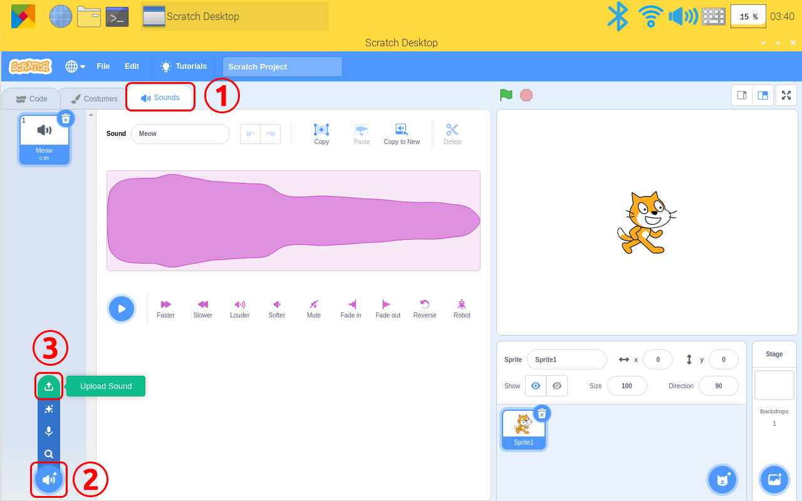
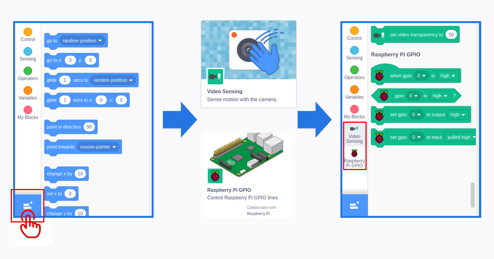
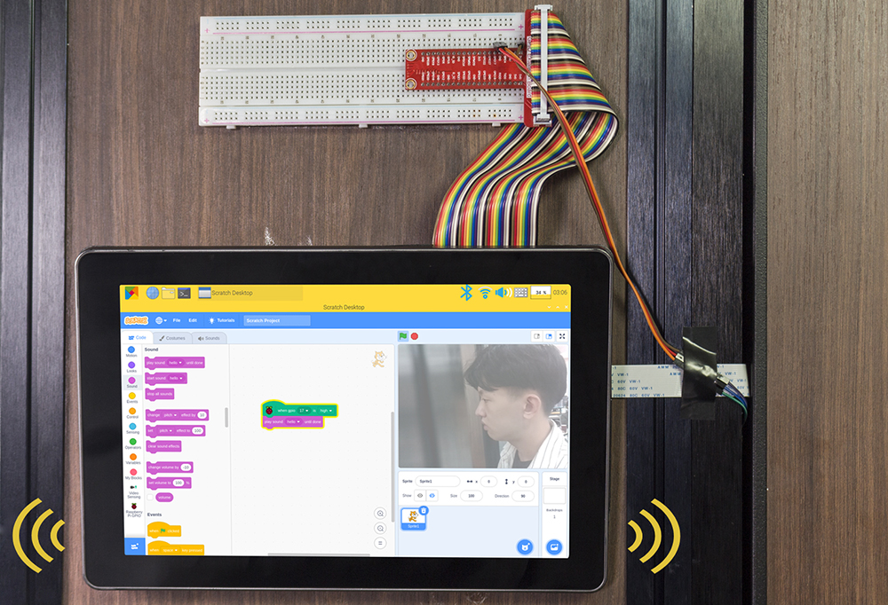

自定义 RasPad 监控设备
============================

描述
-------------

您可以将 RasPad3 变成与朋友一起玩的游戏屏幕、显示天气和时间的智能警报、监控机器人动作的显示器以及许多其他有趣的东西。

本文将向您展示如何在您的 RasPad 3 上自定义制作一个 RasPad 监控设备。让我们来看看如何制作吧！

所需组件
-------------------------------

- A RasPad 3
- 8G+ SD卡
- Scratch 3 (either online or offline)
- Micro SD卡读卡器
- 40pin排线
- T型拓展板
- 面包板
- PIR运动传感器模块
- 摄像头模块
- FFC线
- 公-母跳线

你会学到
---------------------

- 在 Scratch 上使用树莓派扩展。
- 在 Scratch 上使用音频功能。
- 使用 PIR 模块。

课程指南
--------------

**搭建电路**

首先链接GPIO扩展板, 具体步骤请阅读 :ref:`GPIO 扩展板`。

将T型GPIO扩展板插入面包板，搭建电路。

摄像头安装教程请参考 :ref:`安装摄像头`.

.. image:: img/banana1.jpg
  :width: 600
  :align: center

**用 Scratch 3 编程**

在这一步中，您将学习如何将准备好的音乐上传到 Scratch。点击左上角的“声音”选项，然后点击“扬声器”图标并选择“上传声音”图标上传准备好的音乐文件 - 你好，最后点击“打开”确认。

点击左下角的添加图标，选择“Video Sensing”和“树莓派GPIO”添加两个功能。

回到主页面，将树莓派GPIO功能中的“when gpio 0 is high”和“play sound (hello) until done”拖到编程区。

将 pir 模块和摄像头贴在门外的墙上，并将 RasPad 贴在门内或任何地方的墙上。当门打开时，您会听到音乐，然后看到谁在那里。

如果你不喜欢阅读文字，可以观看视频。

.. raw:: html

  <iframe width="695" height="576" src="https://www.youtube.com/embed/Ti_YQjuZ9TM" title="YouTube video player" frameborder="0" allow="accelerometer; autoplay; clipboard-write; encrypted-media; gyroscope; picture-in-picture" allowfullscreen></iframe>

在本文中，我们将介绍如何使用 RasPad 3 自定义制作一个 RasPad 监控设备。当然，您还可以添加一个继电器和一个步进电机，以便在门口检测到人时可以自动打开门。

