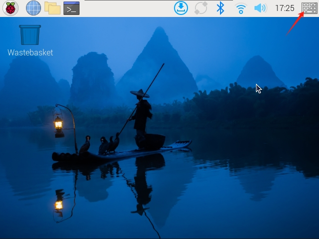
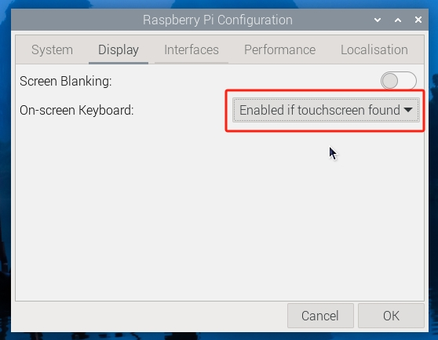

.. note::

    Hello, welcome to the SunFounder Raspberry Pi & Arduino & ESP32 Enthusiasts Community on Facebook! Dive deeper into Raspberry Pi, Arduino, and ESP32 with fellow enthusiasts.

    **Why Join?**

    - **Expert Support**: Solve post-sale issues and technical challenges with help from our community and team.
    - **Learn & Share**: Exchange tips and tutorials to enhance your skills.
    - **Exclusive Previews**: Get early access to new product announcements and sneak peeks.
    - **Special Discounts**: Enjoy exclusive discounts on our newest products.
    - **Festive Promotions and Giveaways**: Take part in giveaways and holiday promotions.

    👉 Ready to explore and create with us? Click [|link_sf_facebook|] and join today!

.. _screen_resolution_or_orientation:

CHANGING SCREEN RESOLUTION OR ORIENTATION
===========================================

When you insert an SD card with the operating system already installed into your Raspberry Pi, and power on the display, the desktop should appear on the screen by default.

The latest Raspberry Pi OS (Bookworm and later) comes with several useful features, including a virtual on-screen keyboard and the ability to long-press for context menus. These features are ready to use without additional setup.

In addition to these enhancements, you can customize the screen by adjusting the resolution or changing the screen orientation to suit your needs.

Let's explore how to perform these tasks step by step.

Using an On-Screen Keyboard
-------------------------------------

Raspberry Pi OS Bookworm and later include the **Squeekboard** on-screen keyboard by default. This keyboard automatically appears when text input is needed and hides when it's not. For applications that do not support text entry detection, you can manually toggle the keyboard by clicking the keyboard icon at the right end of the taskbar.

Alternatively, you can configure the on-screen keyboard to always show or hide via the **Display** tab in **Raspberry Pi Configuration** or the **Display** section of ``raspi-config``.

.. note::

    If you are using a version of Raspberry Pi OS prior to Bookworm, use **matchbox-keyboard** as the on-screen keyboard. For the Wayfire desktop compositor, use ``wvkbd`` instead.

Setting the Screen Resolution
-------------------------------------

1. Click the **Raspberry Pi icon** -> **Preferences** -> **Screen Configuration**.

   .. image:: img/quick_rpi_config.png
      :width: 600

2. In the configuration menu, click the triangle icon at the bottom left corner, select **HDMI-A-1** -> **Resolution**, and choose your desired resolution.

   .. image:: img/quick_rpi_resolution.png
      :width: 600

3. Finally, click **Apply** -> **OK** to save and apply the changes.

   .. image:: img/quick_rpi_apply.png
      :width: 600

Changing Screen Orientation
--------------------------------

If you need to physically rotate the screen or mount it in a specific position:

1. Click the **Raspberry Pi icon** -> **Preferences** -> **Screen Configuration**.

   .. image:: img/quick_rpi_config.png
      :width: 600

2. In the layout editor, **right-click** the touch display rectangle (usually labeled HDMI-A-1), select **Orientation**, and choose the desired option.

   .. image:: img/quick_rpi_orientation.png
      :width: 600

3. Click **Apply** -> **OK** to apply the changes.

   .. image:: img/quick_rpi_apply.png
      :width: 600
