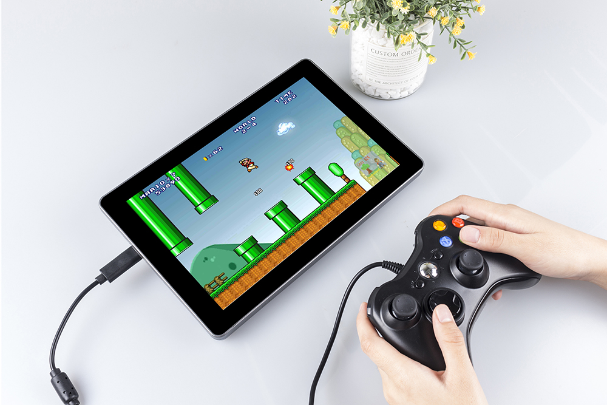
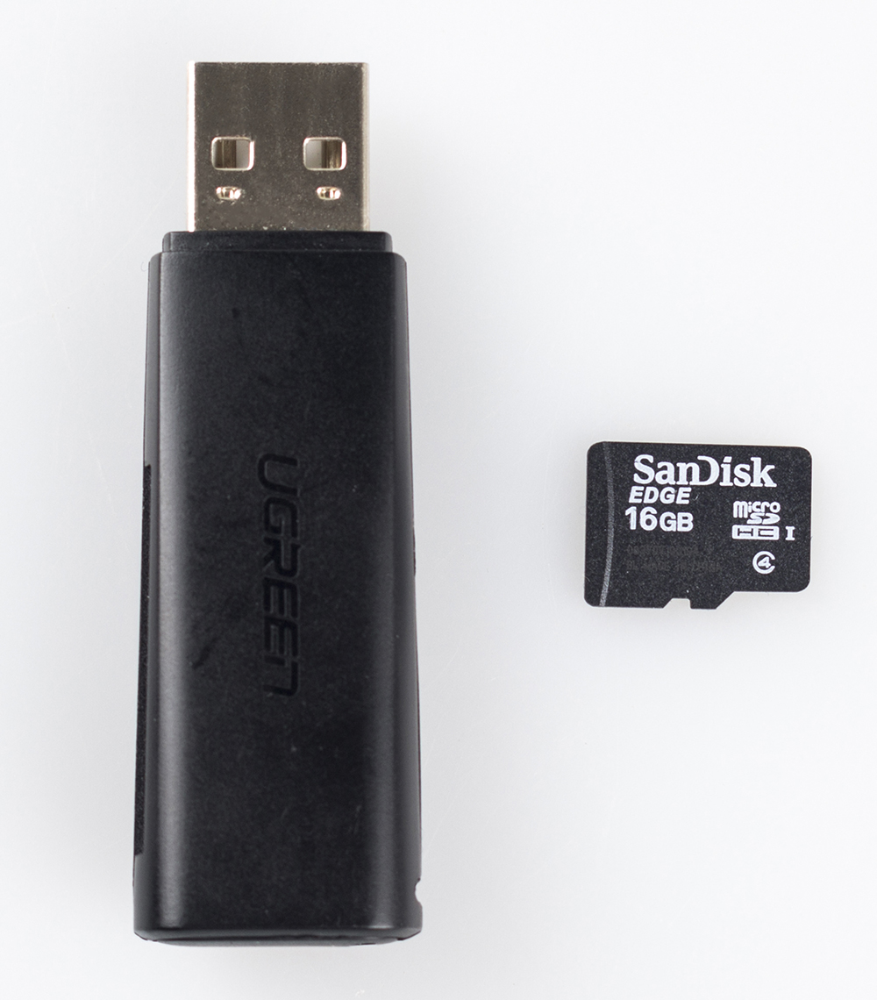
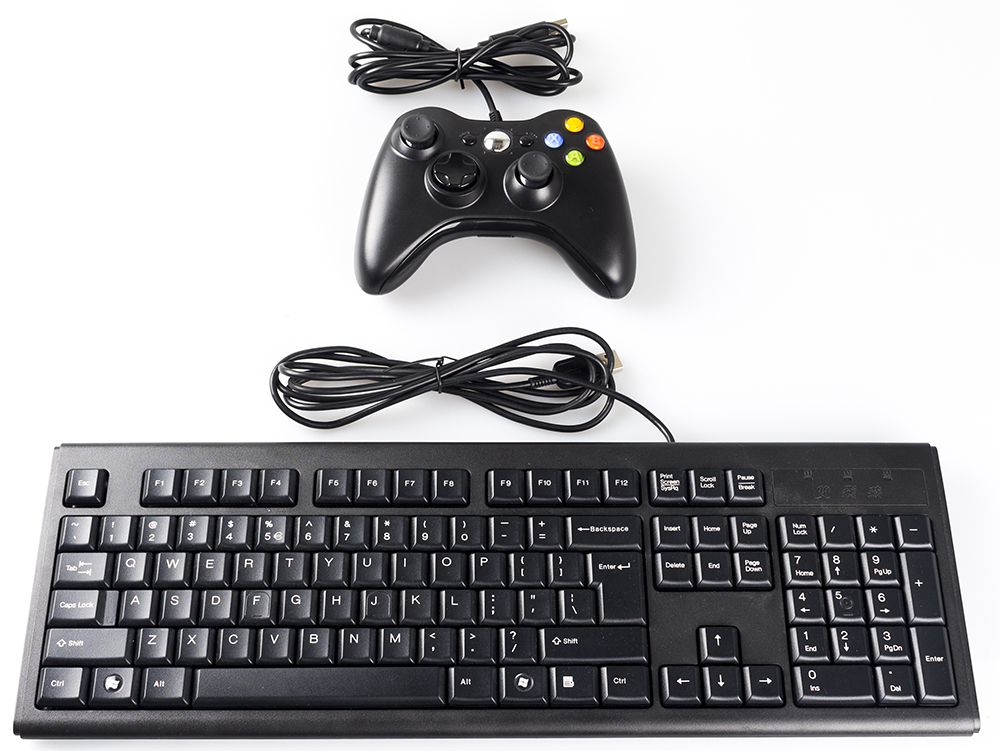
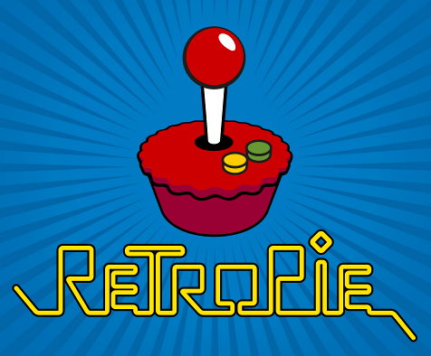
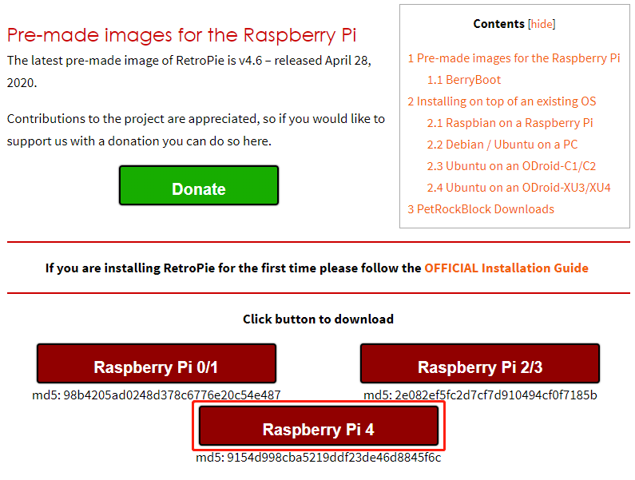
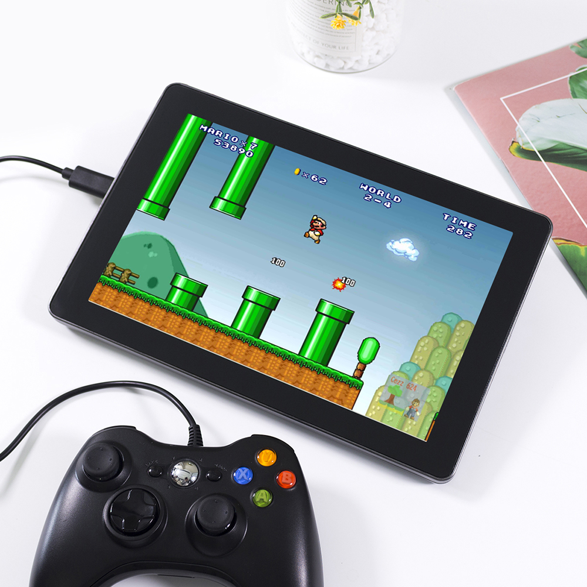

Retro Games Console
======================

Description
-------------

You can turn RasPad 3 into a retro games console playing with your friends, let's see how we can do it!

Required Components
-------------------------------

- A RasPad 3
- 8G+ MicroSD Card
- Micro-SD Card Reader
- Keyboard
- Gamepad

It is recommended to use a Raspberry Pi 4 as the main control board, with Retro Pie as the Operating System.

That Raspberry Pi uploads or downloads the game system and game ROM needs taking up a large memory, so it is recommended to use a large-capacity SD card to avoid configuration failures.

When playing games, a gamepad and a keyboard are needed.

The RasPad is equipped with a 1280x800 LCD touch screen, a 2-watt stereo speaker, and three USB 3.0 ports, allowing for high resolution and sound quality to provide an excellent gaming experience.

.. image:: img/retropie4.jpg
  :width: 600
  :align: center

Game System Installation
---------------------------------

RetroPie allows you to turn your Raspberry Pi, ODroid C1/C2, or PC into a retro-gaming machine. It builds upon Raspbian OS, Emulation Station, RetroArch and many other projects to enable you to play your favorite Arcade, home-console, and classic PC games with the minimum set-up.

Installing **RetroPie**:

**Step 1**: Download the SD image compatible with the Raspberry Pi 4 on the `RetroPie official website <https://retropie.org.uk/>`_.

**Step 2**: After the download is complete, unzip the downloaded package containing the image file.

**Step 3**：Then flash the RetroPie image into the micro-SD card.

* For Windows, use: `Raspberry Pi Imager <https://www.raspberrypi.org/software/>`_, `Etcher <https://www.balena.io/etcher/>`_, or `Win32DiskImager <https://sourceforge.net/projects/win32diskimager/>`_.

.. note::

  Win32DiskImager requires an .img file extracted from the .img.gz image downloaded in step 2. You can use a program like 7zip to do this.

* For macOS, use: `Raspberry Pi Imager <https://www.raspberrypi.org/software/>`_, `Etcher <https://www.balena.io/etcher/>`_, `Apple Pi Baker <https://www.tweaking4all.com/software/macosx-software/macosx-apple-pi-baker/>`_, or the dd command.
* For Linux, use: `Raspberry Pi Imager <https://www.raspberrypi.org/software/>`_, `Etcher <https://www.balena.io/etcher/>`_, or the dd command

.. note::

  MacOS/Linux users can optionally extract the .img image from the downloaded .img.gz by using gunzip (macOS users can also simply double-click it).

.. image:: img/retropie8.png
  :width: 600
  :align: center

**Step 4**: Insert the micro-SD card into the RasPad, and press the power button to boot up the system.

.. warning::
  
  The SD card slot is a snap-in style attached to the back cover. Before removing or replacing the back cover, remove the micro-SD card to avoid damaging the micro-SD card and the RasPad's internal button board.

RetroPie Configuration
-------------------------

After the RasPad boots up, the Controller and WiFi settings should be configured, as well as transferring game ROMs. A keyboard and a gamepad are needed when doing these steps.

The detailed steps are shown in the video:

.. raw:: html

    <iframe width="695" height="576" src="https://www.youtube.com/embed/qIZcwXvhl8Q" title="YouTube video player" frameborder="0" allow="accelerometer; autoplay; clipboard-write; encrypted-media; gyroscope; picture-in-picture" allowfullscreen></iframe>

.. note::
    1. You can also go to RetroPie official website to detailed tutorial: `RetroPie Docs <https://retropie.org.uk/docs/First-Installation/>`_.
    2. RetroPie allows you to turn your Raspberry Pi or PC into a retro-gaming machine. But because of the nature/complexity of copyright/intellectual property law (country-specific), RetroPie doesn't provide ROMs for games. If you want to get them, you can download from the forum or Google to find the sources, then place one ROM under the directory of ``RetroPie emluator``.

Below is an example of the RasPad using the ROM of Super Mario 3.

