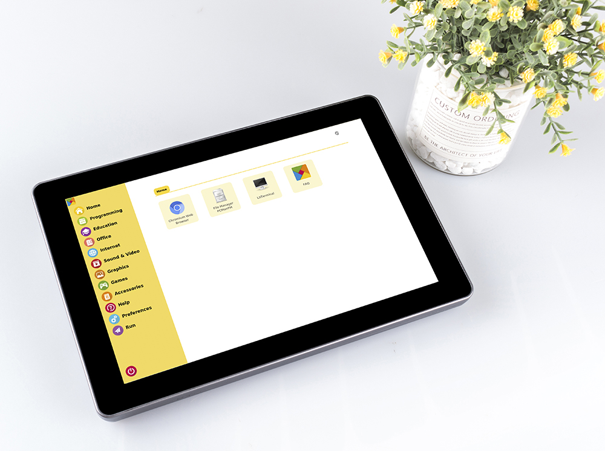

复古游戏机
======================

描述
-------------

您可以将 RasPad 3 变成与您的朋友一起玩的复古游戏机，让我们看看如何做到！

.. image:: img/retropie1.jpg
  :width: 500
  :align: center

所需组件
-------------------------------

- A RasPad 3
- 8G+ MicroSD Card
- Micro-SD Card Reader
- Keyboard
- Gamepad

推荐使用树莓派4作为主控板，Retro Pie 作为操作系统。

树莓派上传或下载游戏系统和游戏ROM需要占用大内存，建议使用大容量SD卡，避免配置失败。

.. image:: img/retropie2.jpg
  :width: 350
  :align: center

玩游戏时，需要一个游戏手柄和一个键盘。

.. image:: img/retropie3.jpg
  :width: 500
  :align: center

RasPad 配备 1280x800 液晶触摸屏、2 瓦立体声扬声器和三个 USB 3.0 端口，可提供高分辨率和音质，提供出色的游戏体验。

游戏系统安装
---------------------------------

RetroPie 可让您将树莓派、ODroid C1/C2 或 PC 变成复古游戏机。它建立在 Raspbian OS、Emulation Station、RetroArch 和许多其他项目的基础上，使您能够以最少的设置玩自己喜欢的街机、家用控制台和经典 PC 游戏。

.. image:: img/retropie5.png
  :width: 500
  :align: center

安装 **RetroPie**:

**第 1 步**: 在 `RetroPie 官网 <https://retropie.org.uk/>`_ 下载兼容树莓派4的SD镜像。

**第 2 步**: 下载完成后，解压所下载的包。

**第 3 步**：然后将 RetroPie 镜像安装到micro-SD 卡。

* 对于 Windows 用户，请使用: `Raspberry Pi Imager <https://www.raspberrypi.org/software/>`_, `Etcher <https://www.balena.io/etcher/>`_, 或者 `Win32DiskImager <https://sourceforge.net/projects/win32diskimager/>`_.

.. note::

  Win32DiskImager  需要从第 2 步中下载的 .img.gz 映像中解压的 .img 文件。您可以使用 7zip 之类的解压软件来解压。

* 对于 macOS 用户, 可用: `Raspberry Pi Imager <https://www.raspberrypi.org/software/>`_, `Etcher <https://www.balena.io/etcher/>`_, `Apple Pi Baker <https://www.tweaking4all.com/software/macosx-software/macosx-apple-pi-baker/>`_, 或者 dd 命令。
* 对于 Linux 用户, 可用: `Raspberry Pi Imager <https://www.raspberrypi.org/software/>`_, `Etcher <https://www.balena.io/etcher/>`_, 或者 dd 命令。

.. note::

  MacOS/Linux 用户可以用 gunzip 从下载的 .img.gz 中提取 .img 图像（当然 macOS 用户也可以直接双击它来解压）。

.. image:: img/retropie8.png
  :width: 600
  :align: center

**第 4 步**: 将 micro-SD 卡插入 RasPad，按下电源键启动系统。

.. warning::
  
  SD 卡插槽采用卡扣式连接到后盖。在拆卸或更换后盖之前，请先取出 micro-SD 卡，以免损坏 micro-SD 卡和 RasPad 的内部按键板。

RetroPie 配置
-------------------------

RasPad 启动后，要配置控制器，设置WiFi，以及传输游戏ROM。执行这些步骤时需要键盘和游戏手柄。

详细步骤如视频所示：

.. raw:: html

    <iframe width="695" height="576" src="https://www.youtube.com/embed/qIZcwXvhl8Q" title="YouTube video player" frameborder="0" allow="accelerometer; autoplay; clipboard-write; encrypted-media; gyroscope; picture-in-picture" allowfullscreen></iframe>

.. note::
    1. 你可以到RetroPie官网查看详细教程: `RetroPie Docs <https://retropie.org.uk/docs/First-Installation/>`_.
    2. RetroPie 可让您将树莓派或 PC 变成复古游戏机。但是由于版权问题，RetroPie 不提供游戏 ROM。如果你想玩更多游戏，可以从论坛或谷歌上下载找到资源，然后将游戏ROM放在 RetroPie emluator 目录下。

下面是玩超级马里奥3的一个示例。

.. image:: img/retropie10.jpg
  :width: 600
  :align: center
