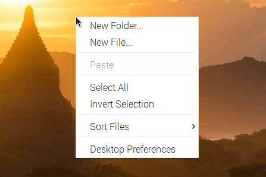

.. note::

    Hello, welcome to the SunFounder Raspberry Pi & Arduino & ESP32 Enthusiasts Community on Facebook! Dive deeper into Raspberry Pi, Arduino, and ESP32 with fellow enthusiasts.

    **Why Join?**

    - **Expert Support**: Solve post-sale issues and technical challenges with help from our community and team.
    - **Learn & Share**: Exchange tips and tutorials to enhance your skills.
    - **Exclusive Previews**: Get early access to new product announcements and sneak peeks.
    - **Special Discounts**: Enjoy exclusive discounts on our newest products.
    - **Festive Promotions and Giveaways**: Take part in giveaways and holiday promotions.

    👉 Ready to explore and create with us? Click [|link_sf_facebook|] and join today!

Right Click on RasPad
===============================

The touchscreen makes it easy to perform simple navigation tasks with your finger or stylus, but you may want to be able to use the context menu (right-click menu).

Then you will need to download a ``Touchégg`` app. Enter the following command to install it.

**For 32-bit OS:**

.. raw:: html

    <run></run>

.. code-block:: shell

    wget https://github.com/JoseExposito/touchegg/releases/download/2.0.14/touchegg_2.0.14_armhf.deb
    sudo apt install ./touchegg_2.0.14_armhf.deb

**For 64-bit OS:**

.. raw:: html 

    <run></run>

.. code-block:: shell

    wget https://github.com/JoseExposito/touchegg/releases/download/2.0.14/touchegg_2.0.14_arm64.deb
    sudo apt install ./touchegg_2.0.14_arm64.deb

After restarting, you can double-tap the screen to bring up the context menu.

.. raw:: html

    <run></run>

.. code-block:: shell

    sudo reboot

**Available gestures**

Swipe
  Swipe gestures are executed when three or more fingers are moved synchronously in the same direction.
  Note that three is the minimum number of fingers that Touchégg allows for swipe gestures on touchpads and two on touchscreens.

Pinch
  Pinch gestures are executed when two or more fingers are located on the touchpad and are either changing the relative distance to each other (pinching) or are changing the relative angle (rotate).

Tap
  Tap gestures are executed when two or more fingers "click" on the touchscreen.

For more details please check `Touchégg <https://github.com/JoseExposito/touchegg>`_. 