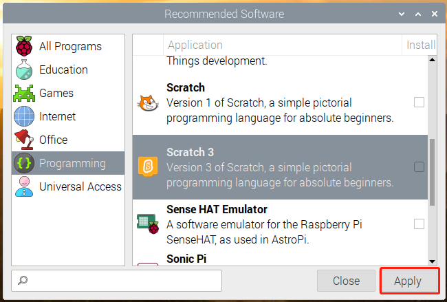

Scratch Projects
=================

In this chapter, you will learn to use Scratch on RasPad 3, which includes 10 examples.

If you are a user who has just used Scratch, we recommend that you try the teaching examples in order so that you can quickly get started with Scratch.

If the Raspberry Pi system you downloaded comes with recommended software, you can find Scratch 3 in **Programming**.

If you download a system with only a desktop, you can click **Preferences** -> **Recommended Software** -> **Programming** to install the Scratch 3 on RasPad 3.

    

.. note::
    Before trying the teaching examples, you should have downloaded the relevant materials and code files.

    Open a Terminal and enter the following command to download them from github.

    .. code-block::

        git clone https://github.com/sunfounder/raspad3.git

Projects
----------------------

.. toctree::
    :maxdepth: 1

    animate_a_name
    create_a_story
    make_music
    clicker_game
    shooting_game
    hit_the_magic_fish
    binary_game
    flappy_parrot
    paint_box
    eating_banana_game
    create_musical_instrument
    raspad_monitor_device

