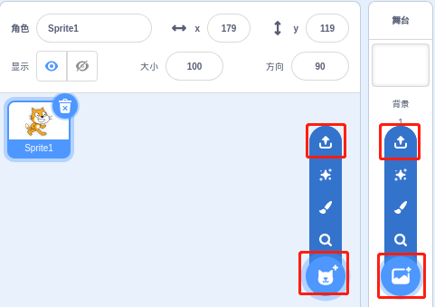
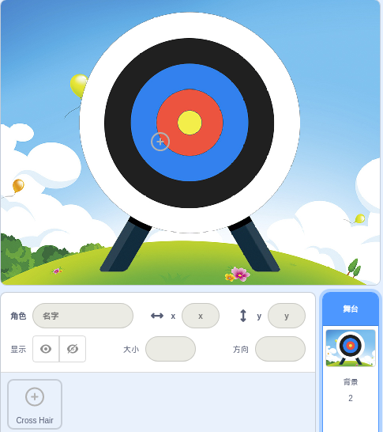
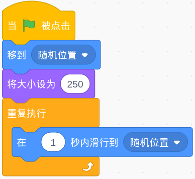
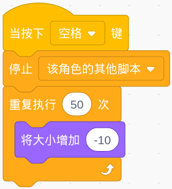
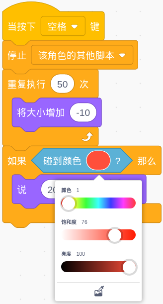
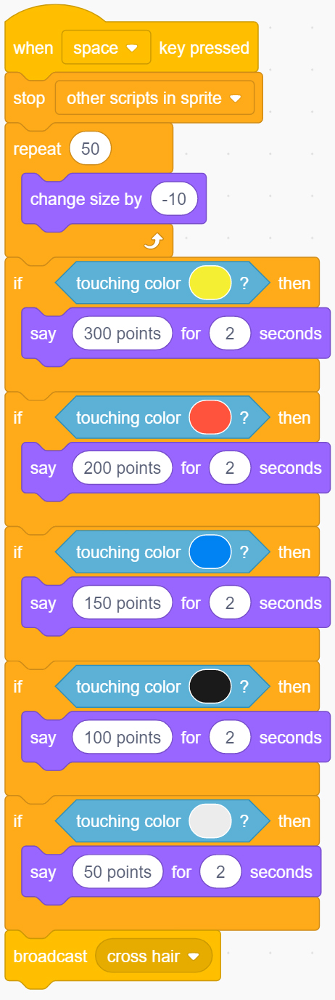

Shooting Game
===============

Description
-------------

Have you seen those shooting games on TV? The closer a contestant shoots a bullet on the target to the bullseye, the higher his score. 

Today we are also doing a shooting game in Scratch. In the game, let the Crosshair shoot as far as possible to the bullseye to get a higher score.

Click on the green flag to start. Use the space bar to shoot an bullet.

.. raw:: html

    <iframe src="https://scratch.mit.edu/projects/526927915/embed" allowtransparency="true" width="695" height="576" frameborder="0" scrolling="no" allowfullscreen></iframe>

Or click `Shooting Game <https://scratch.mit.edu/projects/526927915/editor/>`_, and then learn online tutorial on the Scratch official website.

Required Components
-------------------------------

- A RasPad 3
- Scratch 3 (either online or offline)
- Crosshair Sprite
- Target Backdrop

You Will Learn
---------------------

- Upload new sprites and background images to Scratch.
- The coordinate range of the Scratch stage.
- Stop scripts run by other sprites and get the result of the game.
- Use of Scratch color picker.

Lesson Guide
--------------

Arrange the Crosshair and targets.
^^^^^^^^^^^^^^^^^^^^^^^^^^^^^^^^^^^^^^^^

First, delete the previous sprite, upload the Crosshair sprite and the target background, you can find them under the path ``./raspad3/scratch/materials`` (You have downloaded from `raspad3.git <https://github.com/sunfounder/raspad3.git>`_ before.).

Click the icon below the sprite list, select "Upload Sprite Option", find the **Cross Hair.svg** file, and upload it. Similarly, upload the backdrop, **Target.jpg**.

Let's take aim.
^^^^^^^^^^^^^^^^^^

When aiming, the Crosshair will slightly shake, we are now going to use the 「**glide...**」 block to achieve this effect.

.. image:: img/shooting3.png
  :width: 600
  :align: center

Set the random position and size of the Crosshair sprite.

Now, click on the green flag to see the effect of this aiming...very good. Let's guess, change the time in the 「**glide...**」 block, will the front sight become more stable? Or is it more swaying?

Let's shoot!
^^^^^^^^^^^^^^^^^^

We are now going to express the effect of shooting bullets.

how is it? Stop the crosshair moving, and then let it shrink quickly to create a shooting effect.

This means that when the space bar is pressed, we need to stop shaking the code of the Crosshair and keep the size of the Crosshair sprite shrinking.

Click the green flag to try the effect!

Calculate the score!
^^^^^^^^^^^^^^^^^^^^^^^^^

Then we need to establish a scoring mechanism. Shooting different color circles will get different scores. The closer to the bullseye, the higher the score.

For example, a shot in the red area can score 200 points. Let's use the 「**Touching Color**」 block to judge. This block has a color picker, and we use it to pick up the red color on the target.

Use the same method to set corresponding scores for different color circles.

Challenge
-----------

I believe that you will be smart enough to program and implement this game soon. Next, we will add some challenges to enrich our game content.

- In a game, you can shoot three rounds and then calculate the total score.

