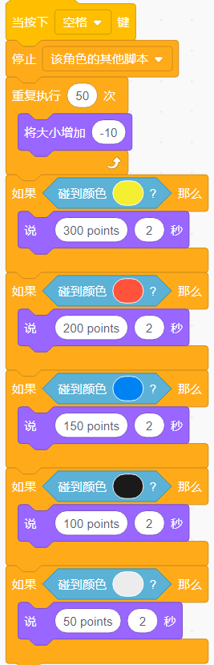

射击游戏
===============

描述
-------------

你在电视上看过那些射击游戏吗？参赛者向靶心射出的子弹越接近靶心，他的得分就越高。

今天我们也在Scratch做一个射击游戏。游戏中，用十字准星尽量射中靶心以获得更高的分数。

点击绿旗开始。使用空格键发射子弹。

.. raw:: html

    <iframe src="https://scratch.mit.edu/projects/526927915/embed" allowtransparency="true" width="695" height="576" frameborder="0" scrolling="no" allowfullscreen></iframe>

或者点击 `Shooting Game <https://scratch.mit.edu/projects/526927915/editor/>`_, 然后在Scratch官网学习在线教程。

所需组件
-------------------------------

- A RasPad 3
- Scratch 3 (either online or offline)
- Crosshair(十字线)精灵
- Target（标靶）背景

你会学到
---------------------

- 将新的角色和背景图片上传到 Scratch。
- Scratch 阶段的坐标范围。
- 停止其他角色运行的脚本并获取游戏结果。
- 使用 Scratch 颜色选择器。

课程指南
--------------

**排列十字准星和靶子**

首先删除之前的角色，上传角色十字准星和背景靶子，在路径 ``./raspad3/scratch/materials`` （之前从 `raspad3.git <https://github.com/sunfounder/raspad3.git>`_ 上下载的）下可以找到这些要上传的图片。

点击角色列表下方的图标，选择“上传角色选项”，找到 Cross Hair.svg 文件，上传。同样，上传背景 Target.jpg。

.. image:: img/shooting1.png
  :width: 600
  :align: center

.. image:: img/shooting2.png
  :width: 600
  :align: center

**瞄准**

瞄准的时候，十字准线会轻微晃动，我们可以用「**在...秒内滑行到...**」的代码块来达到这个效果。

.. image:: img/shooting3.png
  :width: 600
  :align: center

设置十字准星角色的随机位置和大小。

.. image:: img/shooting4.png
  :width: 600
  :align: center

现在，点击绿旗，看看这个瞄准的效果……非常好。让我们猜猜，在「**在...秒内滑行到...**」方块中改变时间，准星会变得更稳定吗？还是更摇摆不定？

**发射！**

我们现在要实现子弹射击的效果。

如何做到呢？先停止移动十字准线，然后让它快速收缩以产生射击效果。

这意味着当按下空格键时，我们需要停止摇动十字准线的代码，并让十字准星的尺寸缩小。

.. image:: img/shooting5.png
  :width: 400
  :align: center

现在点击绿旗试试效果吧。

**计算分数!**

然后我们需要建立一个评分机制。射击不同的色环会得到不同的分数。离靶心越近，得分越高。

例如，在红色区域射门可以得分 200 分。让我们用「**碰到颜色...?**」块来判断。这个块有一个颜色选择器，我们用它来识别目标上的红色。

.. image:: img/shooting6.png
  :width: 400
  :align: center

用同样的方法为不同的色环设置相应的分数。

挑战
-----------

相信你很快就能掌握这个游戏，下面可以尝试添加更多的内容来丰富你的游戏。

- 在一场比赛中，你可以打三轮，然后计算总分。

