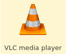
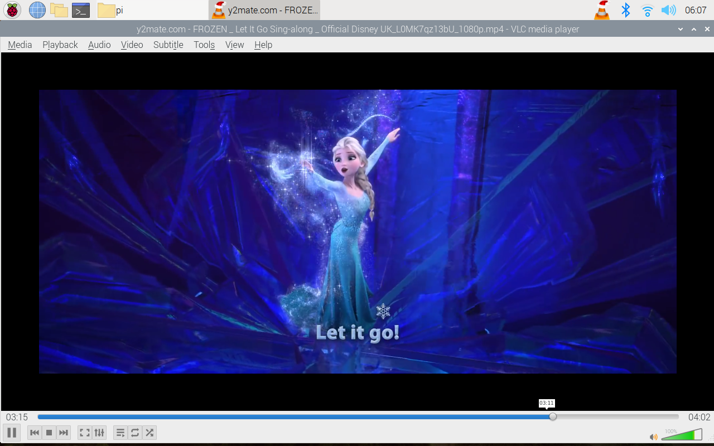
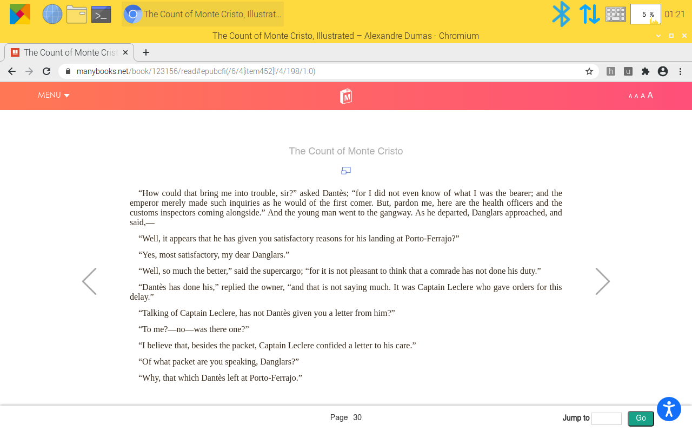
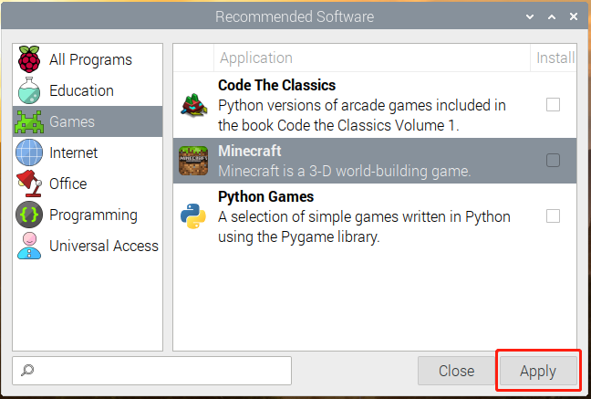
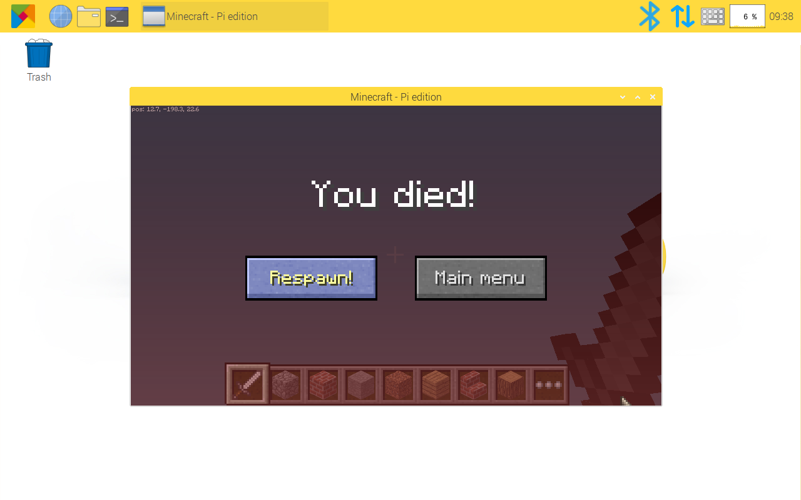

Watch Video and Play Game
=================================

You can watch video, read e-book or play game on RasPad 3.

Watch Video
------------------

RasPad 3 has a built-in video player.

You can watch the local video directly by double-clicking it, or log in to the YouTube website on the Google browser to watch the video.

Read E-book
------------

Read online on Google browser.

Play Game
-----------
You can click **Preferences** -> **Recommended Software** -> **Games** to install the game on RasPad 3.

For example, install **Minecraft**, plug in the mouse and keyboard to play.

